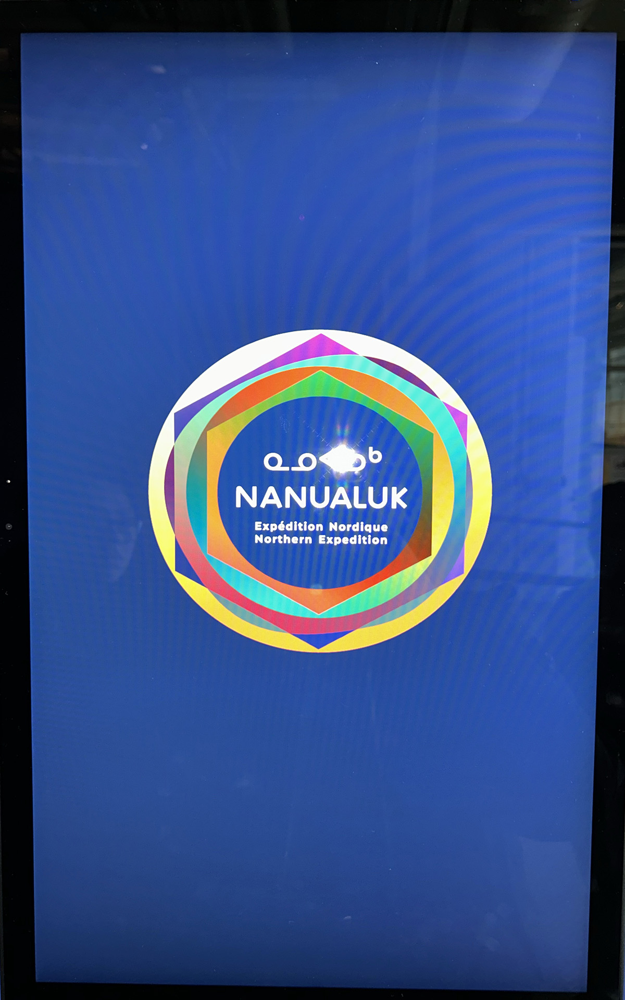
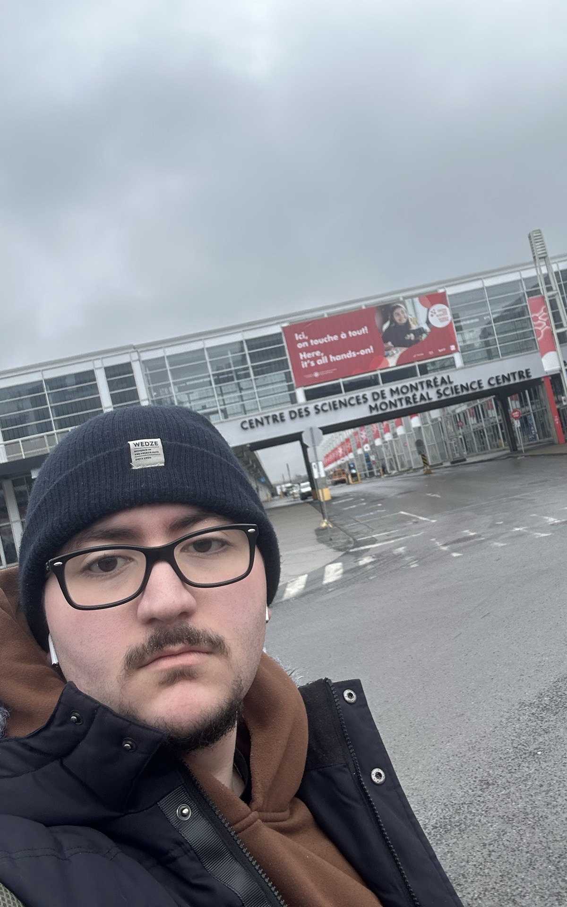
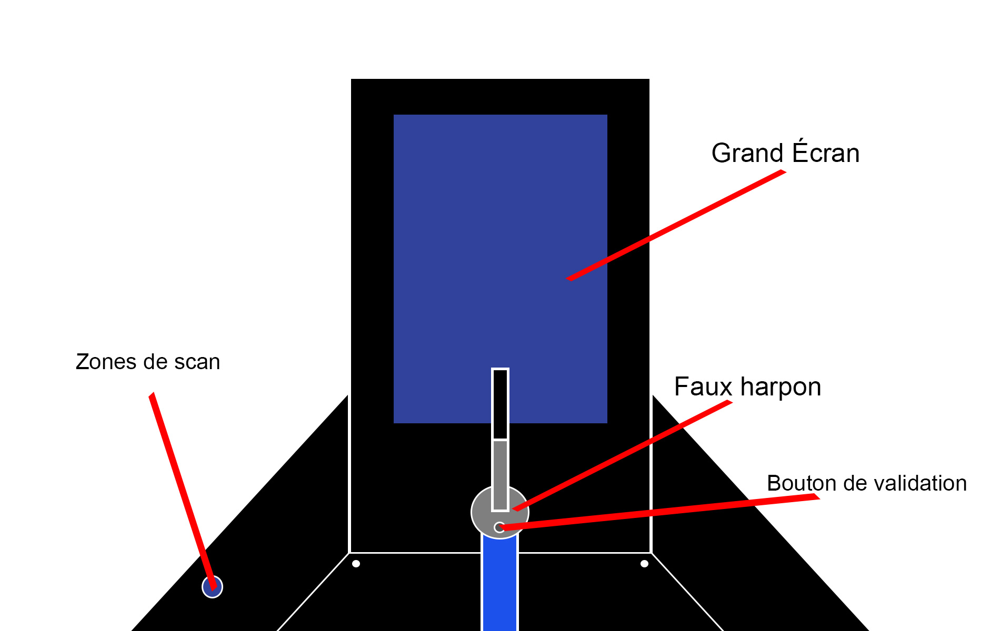
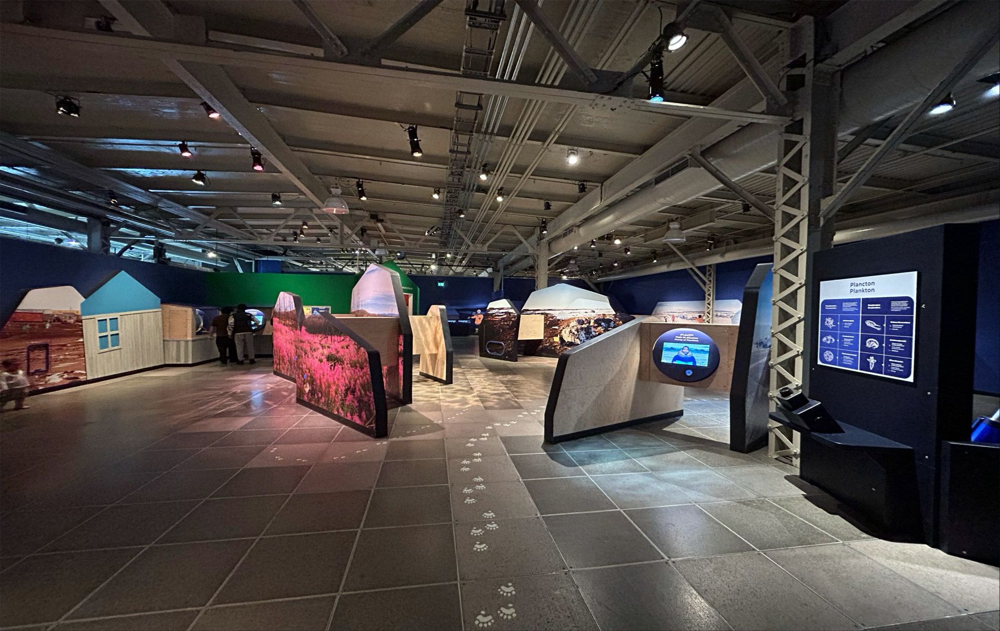

# DEVENIRS PARTAGES. PRATIQUES DE L'IA.

 

> À gauche figure une photo de l'affiche de l'exposition. À droite, une photo de moi devant le lieu où se tenait l'exposition.  
> Photographe pour la photo de droite: Nguyen, Phu Thanh.

## Contexte de l'exposition
**L’exposition Devenirs partagés : pratiques de l’IA** s’inscrit dans un contexte de recherche-création explorant des usages critiques et sensibles de l’intelligence artificielle. Présentée à **l’Université de Montréal**, elle réunit plusieurs artistes invités à expérimenter des approches alternatives aux imaginaires dominants de l’IA, souvent associés à l’automatisation.

L’exposition invite plutôt à voir l’intelligence artificielle comme un outil de relation et de réflexion, qui permet de mieux comprendre les liens entre les humains, la technologie et leur environnement.

- Date de visite : **30 janvier 2026**
- Type d'exposition: **Intérieure et Temporaire**

## Présentation de l'oeuvre
L’œuvre étudiée, **Terre commune (2025)** de **Marion Schneider**, est une **installation interactive** qui explore les liens entre le corps humain, la nature et les systèmes informatiques.

 

> Oeuvre de Marion Schneider, *Terre commune*, 2025, présentée lors de l'exposition **DEVENIRS PARTAGÉS. PRATIQUES DE L'IA. 2026**, ainsi que son cartel d'informations.

**Marion Schneider** est une artiste numérique basée à Montréal. Elle utilise l’installation, la programmation et les technologies interactives pour aborder des thèmes comme l’écologie, la perception et la relation entre les humains et les machines.

Dans Terre commune, l’activité cérébrale du visiteur est captée grâce à un capteur porté sur la tête. Ces données modifient en temps réel un paysage créé par intelligence artificielle, inspiré d’éléments naturels comme la mousse, les lichens et les textures du sol.
L’image change constamment selon l’état mental du participant, ce qui crée une interaction où l’humain et la machine participent ensemble à la création du visuel.

- Titre de l'oeuvre: Terre commune
- Nom de l'artiste : Marion Schneider
- Année de réalisation : 2025
- Type d'installation: Interactive

## Organisation de l'installation

 

> Croquis représentatif de comment est disposée l'oeuvre choisie.

Dans la salle d’exposition, l’œuvre Terre commune est installée de manière à structurer une expérience assise et dirigée vers l’avant. Le visiteur prend place sur un banc, sous lequel se trouve l’ordinateur qui fait fonctionner le dispositif. Cette intégration rend la technologie discrète tout en restant physiquement présente dans l’espace.

 

> Photo de l'une des composantes nécessaires à la conception de l'oeuvre.

En diagonale par rapport au banc, un moniteur est positionné pour recevoir et afficher les signaux transmis par le capteur placé sur le front du participant. Derrière le visiteur, un projecteur est installé et envoie l’image vers le mur situé en face, créant un lien visuel direct entre l’expérience corporelle du participant et la projection observée.

   

> Photos d'autres composantes nécessaires à la conception de l'oeuvre.

Pour que l’œuvre puisse être présentée correctement, certains éléments simples mais essentiels sont nécessaires, notamment un mur blanc servant de surface de projection et un banc permettant au visiteur de s’asseoir et de vivre l’expérience dans une position stable. L’ensemble crée un dispositif à la fois technique et minimal, où chaque élément a une fonction précise.

 

> Photo de l’œuvre de Marion Schneider, *Terre commune*, 2025, présentée lors de l’exposition **DEVENIRS PARTAGÉS. PRATIQUES DE L’IA. 2026**, prise dans un angle pour accentuer les éléments nécessaires à une bonne présentation.

Composantes:
- Ordinateur
- Écran
- Projecteur
- Capteur
- Câbles électrique

Éléments nécessaires à la mise en exposition:
- Mur blanc
- Banc

## Expérience et appréciation de l'oeuvre

Le parcours pour accéder à l’installation est très simple. En entrant dans la salle, il suffit de marcher tout droit pour arriver à Terre commune. Il n’y a pas de mise en scène compliquée, ce qui permet de découvrir l’œuvre naturellement.

 

> Photo d'une vue d'ensemble de la salle d'exposition

Ce qui m’a particulièrement plu est l’aspect interactif lié au capteur. Le fait d’essayer de stabiliser mon cerveau pour calmer les ondes et les lignes affichées à l’écran rend l’expérience très personnelle. On prend conscience de son propre état mental et on tente de le contrôler, ce qui crée un moment de concentration inhabituel et engage réellement le participant dans l’œuvre.

Cependant, un aspect que je ne retiendrais pas dans une création personnelle concerne l’installation de l’ordinateur sous le banc. Il n’est pas protégé, ce qui présente un risque : si le banc se brisait ou si quelqu’un s’asseyait brusquement, l’ordinateur pourrait être endommagé et cela pourrait même causer une blessure. Pour améliorer ce point, je placerais l’ordinateur à côté, dans un boîtier ou une structure de protection, afin d’assurer la sécurité du matériel et des visiteurs.

## Références
- Photographe pour toute la documentation : Berbiche, Wilhene  
- Photographe pour la photo de moi devant le lieu de l'exposition: Nguyen, Phu Thanh.  

Liens consultés:
- (https://schneidermarion.net/)
- (https://nouvelles.umontreal.ca/article/2025/12/04/quatre-artistes-repensent-l-intelligence-artificielle)
