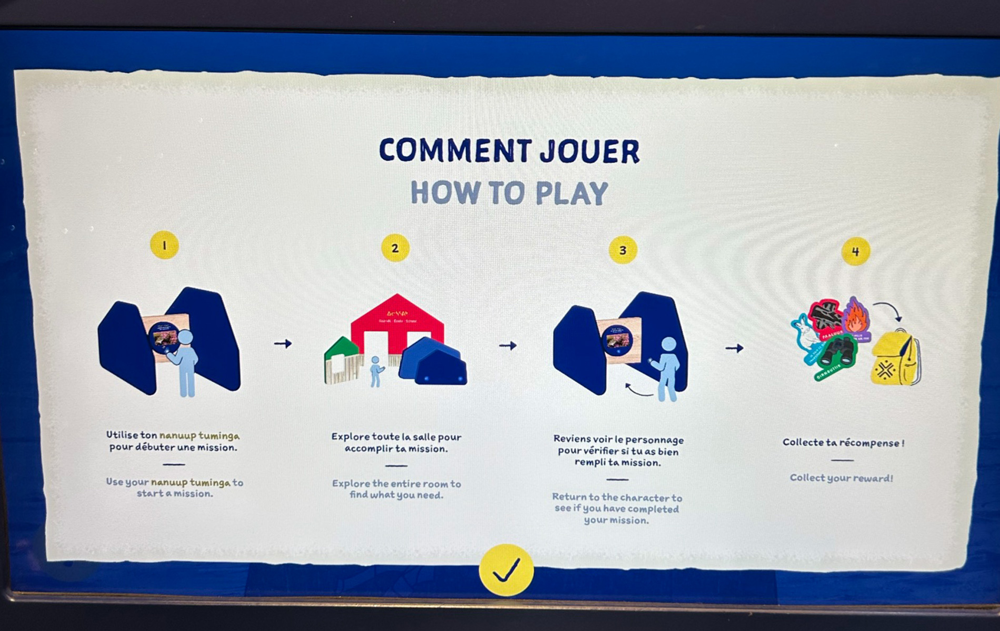

# NANUALUK - EXPÉDITION NORDIQUE

 

> À gauche figure une photo de l'affiche de l'exposition. À droite, une photo de moi devant le lieu où se tenait l'exposition.  

## Contexte de l'exposition
**L’exposition NANUALUK - EXPÉDITION NORDIQUE** s’inscrit dans une démarche de sensibilisation aux réalités du Nord canadien et aux enjeux environnementaux qui y sont liés. Présentée au **Centre des sciences de Montréal**, elle propose une expérience immersive qui met en lumière les impacts des changements climatiques sur les écosystèmes arctiques et les communautés qui y vivent.

L’exposition invite, à travers différentes installations interactives et immersives, les visiteurs à explorer le territoire nordique, à comprendre les défis liés à cet environnement extrême et à réfléchir à la relation entre les humains, la nature et le climat. Elle combine des éléments visuels, sonores et interactifs afin de créer une expérience éducative et engageante.

- Date de visite : **1er Avril 2026**
- Type d'exposition: **Intérieure et Permanente**

## Présentation du dispositif
Le dispositif étudié, **Une glace fragile (2025)**, conçu par **l’équipe du Centre des sciences de Montréal** en collaboration avec la firme montréalaise **GSM Project**, est une installation **interactive** et **immersive** qui propose aux visiteurs de relever un défi lié à la vie dans l’Arctique.

 

> Dispositf de l’équipe du Centre des sciences de Montréal** en collaboration avec la firme montréalaise **GSM Project**, **Une glace fragile**, 2026, présentée lors de l'exposition **NANUALUK - EXPÉDITION NORDIQUE 2026**, ainsi que son texte explicatif.

**GSM Project** est une firme montréalaise spécialisée dans la conception d’expositions muséales et d’expériences immersives. L’entreprise développe des installations qui combinent scénographie, technologies multimédias et interaction afin de rendre les contenus scientifiques et culturels plus accessibles au public.

Dans Une glace fragile, les visiteurs doivent, par exemple, traverser un lac gelé en testant la solidité de la glace à l’aide d’un harpon, après avoir reçu des explications sur la bonne technique à utiliser. Ce type d’activité permet de comprendre concrètement les réalités et les dangers liés à cet environnement.

- Titre de l'oeuvre: **Une glace fragile**
- Nom de l'artiste : Centre des sciences de Montréal & GSM Project
- Année de réalisation : 2025
- Type d'installation: Interactive et immersive

## Organisation de l'installation
La fonction du dispositif est de plonger les visiteurs dans une situation immersive inspirée de la vie dans l’Arctique. À travers un mini-jeu interactif, les participants doivent traverser un lac gelé en utilisant un harpon pour tester la solidité de la glace. Le dispositif sert à la fois de mise en contexte et de support pédagogique, en permettant aux visiteurs de comprendre les dangers et les techniques utilisées dans cet environnement. En manipulant le harpon et en prenant des décisions, les participants vivent une expérience concrète qui les sensibilise aux réalités du Nord.

 

> Croquis représentatif de comment est disposée l'oeuvre choisie.

Dans l’espace d’exposition, le visiteur commence par scanner son badge sur une zone circulaire, ce qui active un écran situé juste au-dessus. Celui-ci présente un court contexte avant de diriger le participant vers la zone de jeu.

 

> Photo de l'une des composantes nécessaires à la conception de l'oeuvre.

Sur la gauche, le dispositif principal est composé d’un harpon interactif permettant de contrôler le déplacement dans le jeu. Le visiteur doit tester différentes zones de glace avant d’avancer. Les mouvements du harpon sont captés par des capteurs dissimulés, ce qui permet de diriger le personnage à l’écran.

   

> Photos d'autres composantes nécessaires à la conception de l'oeuvre.

Un grand écran est placé devant le visiteur pour afficher le jeu, accompagné de haut-parleurs qui diffusent le son de l’expérience. Une fois le parcours terminé, le participant doit scanner une seconde zone pour valider l’activité et recevoir une récompense virtuelle.

 

> Photo de l’œuvre de Marion Schneider, *Terre commune*, 2025, présentée lors de l’exposition **DEVENIRS PARTAGÉS. PRATIQUES DE L’IA. 2026**, prise dans un angle pour accentuer les éléments nécessaires à une bonne présentation.

Composantes:
- Badge interactif
- Écran tactile
- Grand écran (affichage du jeu)
- Haut-parleurs
- Zones de scan (capteurs)
- Capteurs de mouvement (harpon)
- Bouton de validation intégré
- Système d’éclairage
- Câbles électrique

Éléments nécessaires à la mise en exposition:
- Structures en bois (support technique)
- Petits murs (délimitation de l’espace)
- Faux harpon (objet physique interactif)

## Expérience et appréciation de l'oeuvre

Le parcours pour accéder au dispositif est simple et rapide. En entrant dans la salle d’exposition, il suffit de marcher en diagonale vers la droite pour atteindre l’installation. Le trajet est clair et permet de repérer facilement le dispositif.

 

> Photo d'une vue d'ensemble de la salle d'exposition

Ce qui m’a particulièrement plu est le mini-jeu proposé. Il est facile à comprendre, mais reste engageant. Le fait de devoir tester la glace avec le harpon avant d’avancer permet de mieux comprendre les dangers réels auxquels les personnes du Nord font face. L’activité est à la fois amusante et éducative, ce qui rend l’expérience intéressante.

Cependant, un aspect que je ne retiendrais pas dans une création personnelle concerne les zones de scan. Elles ne se désactivent pas après utilisation, ce qui permet à d’autres visiteurs de scanner leur badge pendant qu’une partie est en cours. Cela peut créer des bugs et empêcher le joueur de recevoir son insigne même s’il a réussi le défi. Pour améliorer ce point, il serait préférable de bloquer l’accès aux zones de scan pendant une partie.

## Références
- Photographe pour toute la documentation : Berbiche, Wilhene  

Liens consultés:
- (https://schneidermarion.net/](https://www.centredessciencesdemontreal.com/exposition-permanente/nanualuk-expedition-nordique)
- (https://nouvelles.umontreal.ca/article/2025/12/04/quatre-artistes-repensent-l-intelligence-artificielle](https://www.lapresse.ca/arts/arts-visuels/2025-03-05/nanualuk/expedition-nordique-au-centre-des-sciences.php)
