# Palmarès de l'exposition RÉSEAU VIVANT : classement par ordre de préférence

## **Symbiose** - 2ème🥈

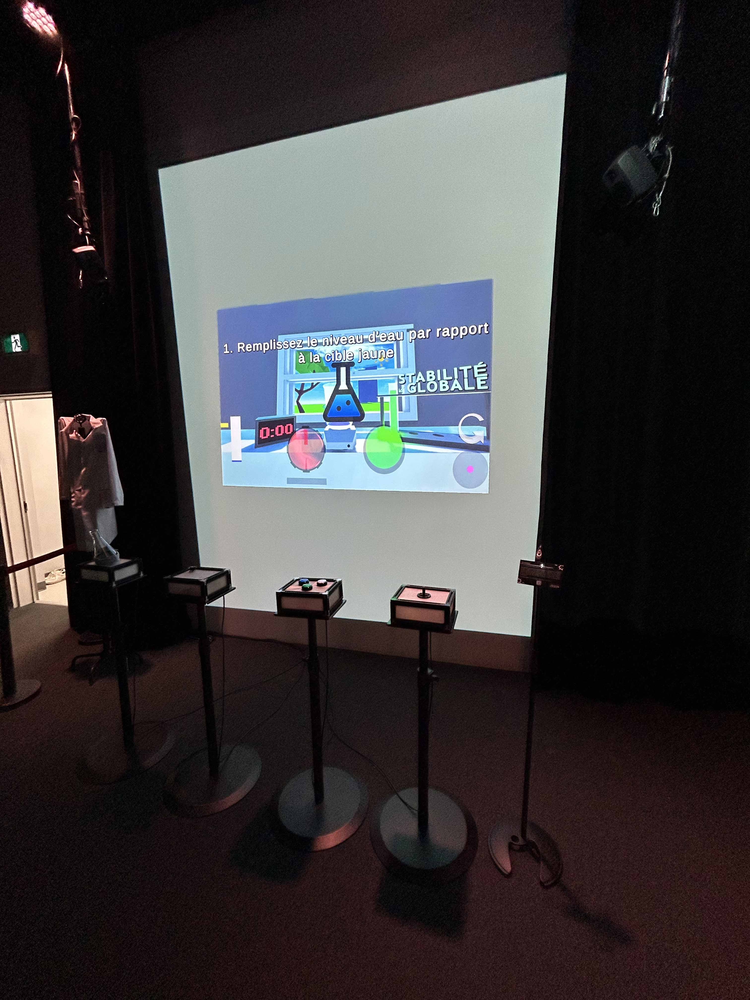

> Installation finale de l'oeuvre de l'équipe Symbiose, *Symbiose*, 2026, présentée lors de l'exposition **RÉSEAU. 2026**.  
> Noms des créateurs et créatrices: **Yannick Chamberland**, **Benjamin Ferland**, **Ryan Dufault** et **Walid Cheour**.

### Schéma de l'installation prévue

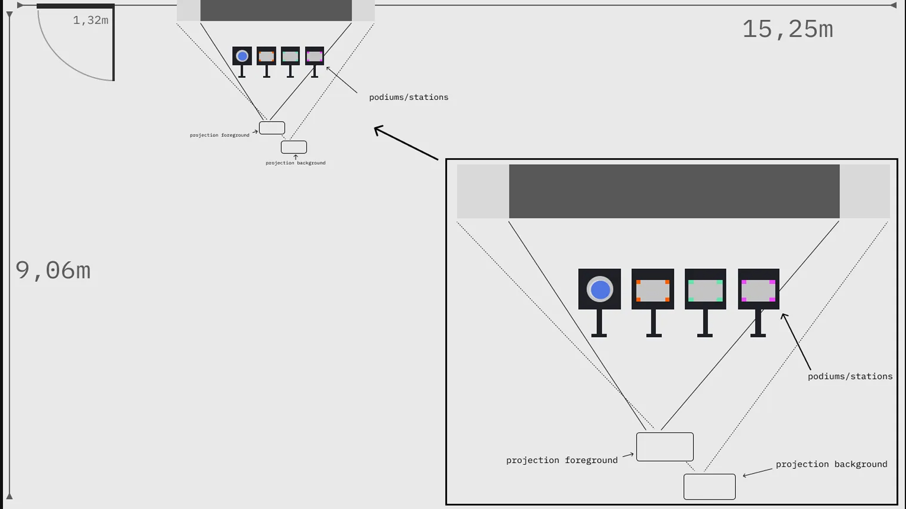

> Capture d'écran du schéma d'implémentation du site web https://les-chimistes.github.io/symbiose/#/technique/, consulté le 27 mars 2026

### Ressenti
      
Avant d’essayer, je pensais que l’expérience n’allait pas être très amusante, car le concept semblait assez simple. Après l’avoir testée, j’ai finalement trouvé ça vraiment intéressant. Le jeu demande d’être concentré en tout temps et de bien coordonner ses actions avec les autres joueurs. J’ai particulièrement aimé le défi et le fait de vouloir battre des records, ce qui rend l’expérience très engageante.  
--- ---
| **Trois** cours du programme qui vous semblent incontournables pour avoir les compétences pour créer ce genre de projet | 
| :--- |
| Programmation interactive |
| Objets interactifs |
| Animation 2D |

### Technique inconnu

[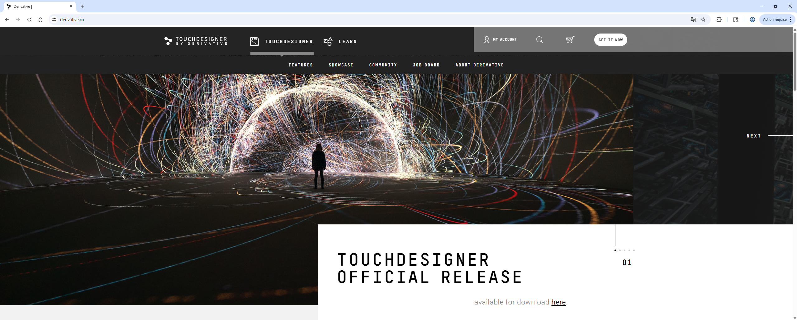](https://derivative.ca/) 
> Capture d'écran du site web https://derivative.ca/, consulté le 27 mars 2026.

TouchDesigner est un logiciel de Derivative qui permet de créer des applications interactives en 2D et 3D en temps réel. Il fonctionne comme un langage de programmation visuel basé sur des “nœuds”, ce qui permet de construire des projets sans coder de manière traditionnelle. Il est conçu pour offrir beaucoup de flexibilité afin de créer des systèmes interactifs, des visuels et des applications multimédia en temps réel.

## **Océean rouge** - 3ème🥉

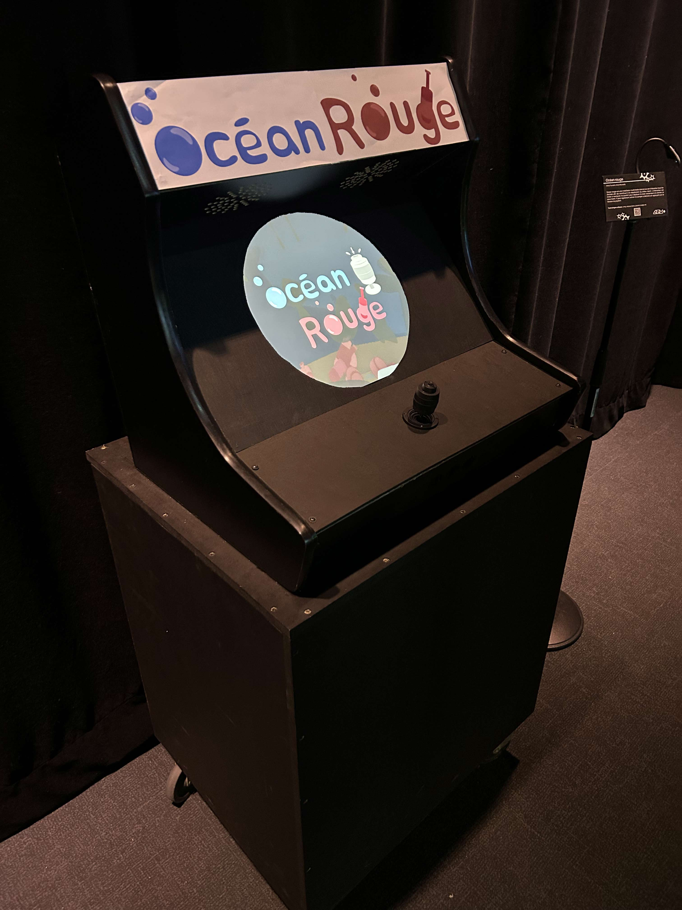

> Installation finale de l'oeuvre de l'équipe Océean rouge, *Océean rouge*, 2026, présentée lors de l'exposition **RÉSEAU. 2026**.  
> Noms des créateurs et créatrices: **Amira Tounekti** et **Kristy Moussally**.

### Schéma de l'installation prévue

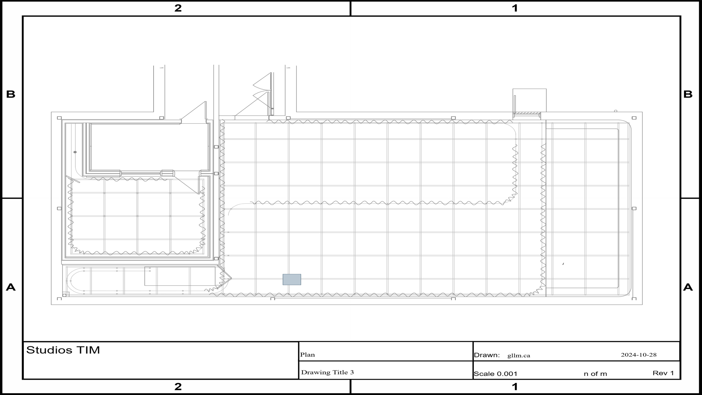

> Capture d'écran du schéma d'implémentation du site web https://deux-intelligence.github.io/deux-neurones/#/technique/, consulté le 27 mars 2026

### Ressenti

Au début, je n'avais pas envie d'essayer car l'installation n'était pas très attirante comparée aux autres œuvres de l'exposition. Après l’avoir testée, j’ai trouvé l’expérience plus intéressante. Le style rétro et l’ambiance immersive rendent le jeu agréable, et le joystick apporte une interaction originale.

--- ---
| **Trois** cours du programme qui vous semblent incontournables pour avoir les compétences pour créer ce genre de projet | 
| :--- |
| Installation multimédia |
| Traitement audiovisuel |
| Animation 2D |

### Technique inconnu

[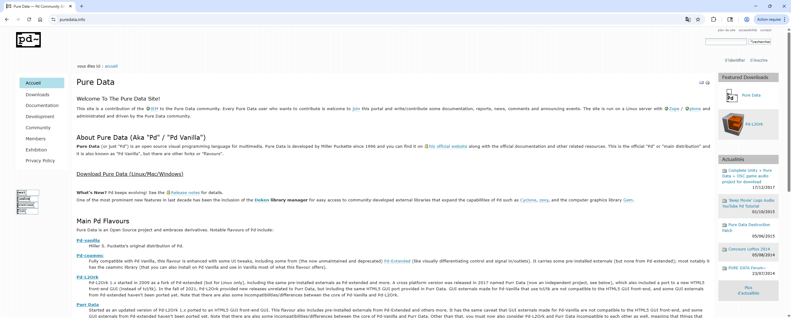](https://puredata.info/)
> Capture d'écran du site web https://puredata.info/, consulté le 27 mars 2026.

Pure Data est un logiciel de programmation visuelle open source conçu pour créer de la musique interactive et des œuvres multimédias en temps réel ; il permet de manipuler et traiter différents types de données (comme l’audio, la vidéo ou les signaux de capteurs) en connectant des objets graphiques entre eux, afin d’analyser, générer et transformer du son et d’autres médias dans des contextes artistiques, expérimentaux ou interactifs.

## **Mission Décollage** - 4ème🏅

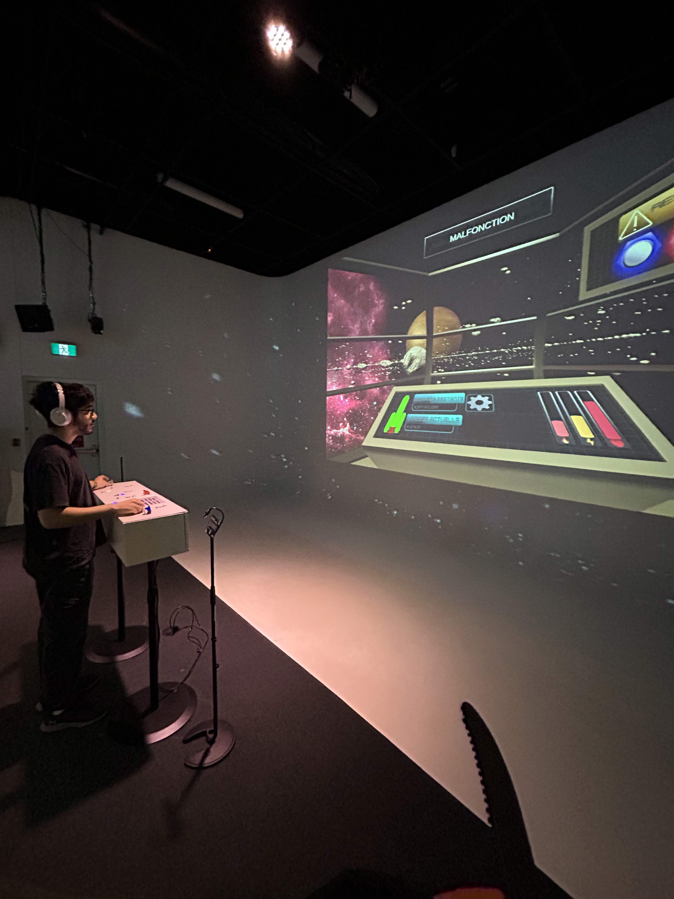

> Installation finale de l'oeuvre de l'équipe Mission décollage, *Mission décollage*, 2026, présentée lors de l'exposition **RÉSEAU. 2026**.  
> Noms des créateurs et créatrices: **Ahmed Kaissoumi**, **Radhouane Kordan**, **Justin Montpetit**, **Thearylou Lach** et **Jad Saloumi**.

### Schéma de l'installation prévue

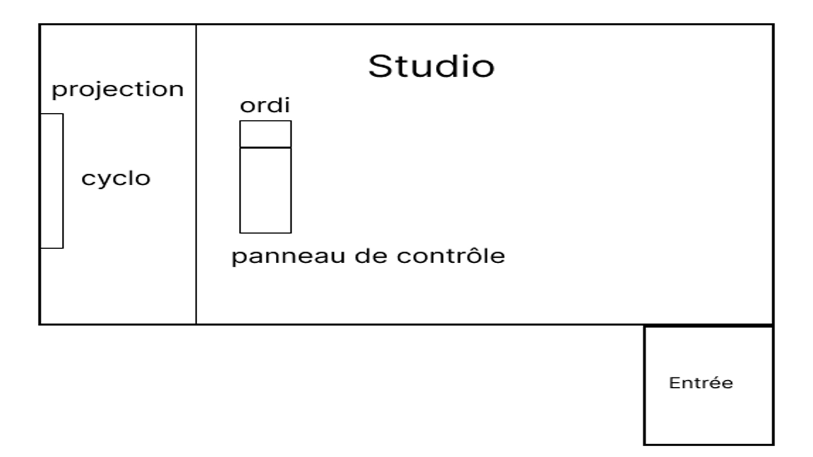

> Capture d'écran du schéma d'implémentation du site web https://o-i-g-n-o-n.github.io/Mission-decollage/#/technique/, consulté le 27 mars 2026

### Ressenti

Avant d’essayer, je pensais que le jeu serait trop compliqué. Après l’avoir testé, cette impression s’est confirmée : il y a beaucoup de choses à gérer et les boutons ne sont pas toujours clairs. Malgré cela, l’expérience reste amusante grâce à l’aspect coopératif.

--- ---
| **Trois** cours du programme qui vous semblent incontournables pour avoir les compétences pour créer ce genre de projet | 
| :--- |
| Réalité mixte |
| Programmation interactive |
| Animation 3D |

### Technique inconnu

> Capture d'écran du site web https://docs.arduino.cc/arduino-cloud/guides/arduino-c/, consulté le 27 mars 2026.

Le langage Arduino est une version simplifiée du C/C++ utilisée pour programmer les cartes Arduino : il permet d’écrire facilement des instructions pour faire fonctionner des composants électroniques comme des LED, des capteurs ou des moteurs. Sur le site officiel Arduino, il est expliqué que ce langage repose sur une structure simple avec deux fonctions principales (setup() pour démarrer et loop() qui se répète en continu), ce qui le rend facile à apprendre même pour les débutants.

## **Arbre en face** - 5ème🏅

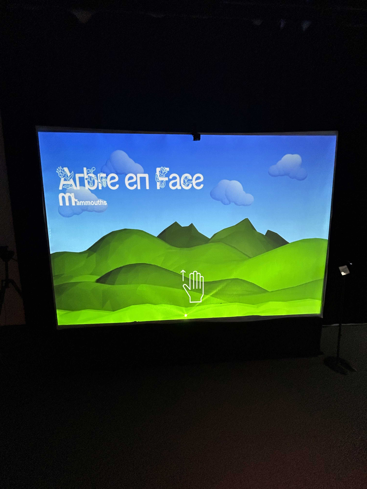

> Installation finale de l'oeuvre de l'équipe Arbre en face, *Arbre en face*, 2026, présentée lors de l'exposition **RÉSEAU. 2026**.  
> Noms des créateurs et créatrices: **Alexandre Gendron**, **Mikael Arseneau**, **Mathieu Willett**, **Matis Ghariani** et **Rafael Angon Dube**.

### Schéma de l'installation prévue

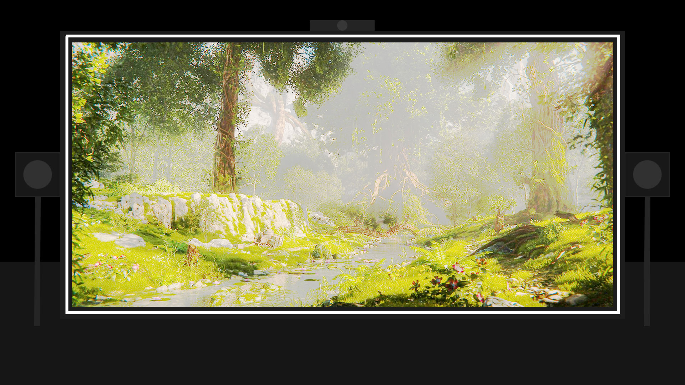

> Capture d'écran du schéma d'implémentation du site web https://mammouths.github.io/projet/#/technique/, consulté le 27 mars 2026

### Ressenti

Avant d’essayer, je pensais que ce serait amusant. Après l’avoir testée, j’ai trouvé l’expérience décevante, car il n’y a pas beaucoup d’interactions. Cela devient rapidement répétitif.

--- ---
| **Trois** cours du programme qui vous semblent incontournables pour avoir les compétences pour créer ce genre de projet | 
| :--- |
| Animation 2D |
| Traitement audiovisuel |
| Illustration numérique |

### Technique inconnu

[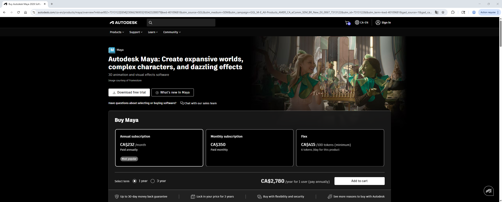](https://surl.li/ttoreo)
> Capture d'écran du site web https://surl.li/ttoreo, consulté le 27 mars 2026.

Le logiciel Autodesk Maya est un outil professionnel de création 3D utilisé pour modéliser, animer et rendre des images et des scènes complexes. Selon son site officiel, il permet de produire des effets visuels, des animations de personnages et des environnements réalistes pour le cinéma, les jeux vidéo et la télévision. Il offre également des fonctionnalités avancées comme la simulation physique, le rigging et le rendu haute qualité pour des productions de niveau professionnel.

## **Quand les yeux se croisent** - 6ème🏅

> Installation finale de l'oeuvre de l'équipe Quand les yeux se croisent, *Quand les yeux se croisent*, 2026, présentée lors de l'exposition **RÉSEAU. 2026**.  
> Noms des créateurs et créatrices: **Edelwyn Ledru**, **Félix Lavoie**, **Jade Hébert**, **Manel Yaya** et **Patricia Nassif**.

### Schéma de l'installation prévue

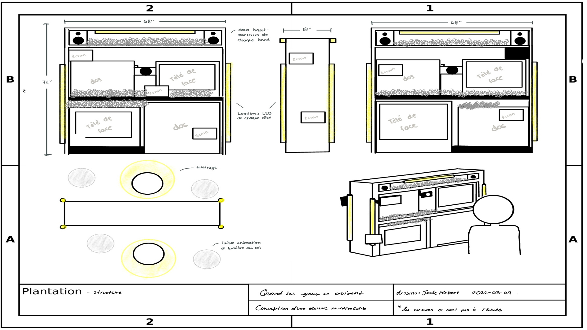

> Capture d'écran du schéma d'implémentation du site web https://emersiaa.github.io/Quand-les-yeux-se-croisent/#/technique/, consulté le 27 mars 2026

### Ressenti

Avant d’essayer, j’avais beaucoup d’attentes à cause du design. Après l’avoir testée, j’ai été déçu, car il y avait peu d’interactions. De plus, certains problèmes techniques rendaient l’expérience moins agréable.

--- ---
| **Trois** cours du programme qui vous semblent incontournables pour avoir les compétences pour créer ce genre de projet | 
| :--- |
| Vidéo 2 |
| Traitement audiovisuel |
| Installation multimédia |

### Technique inconnu

[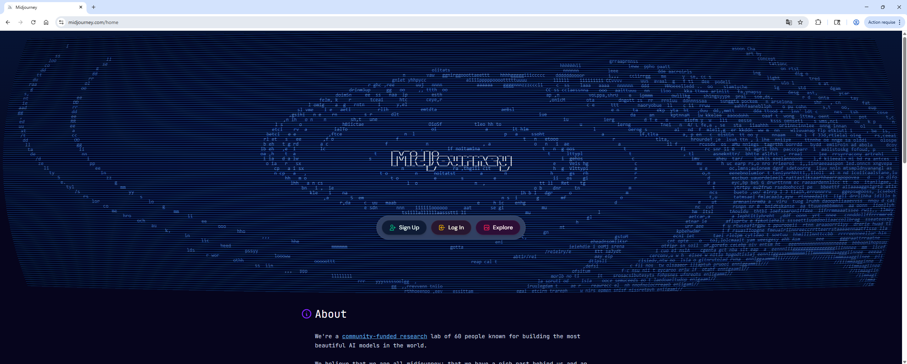](https://www.midjourney.com/home)
> Capture d'écran du site web https://www.midjourney.com/home, consulté le 27 mars 2026.

Midjourney est un logiciel d’intelligence artificielle qui permet de créer des images à partir de descriptions écrites (appelées “prompts”). Il fonctionne en interprétant les mots de l’utilisateur pour générer automatiquement des visuels uniques grâce à des modèles d’apprentissage avancés. Selon son site officiel, l’objectif de Midjourney est d’explorer de nouvelles formes de créativité et d’imagination en utilisant l’IA comme outil artistique.
