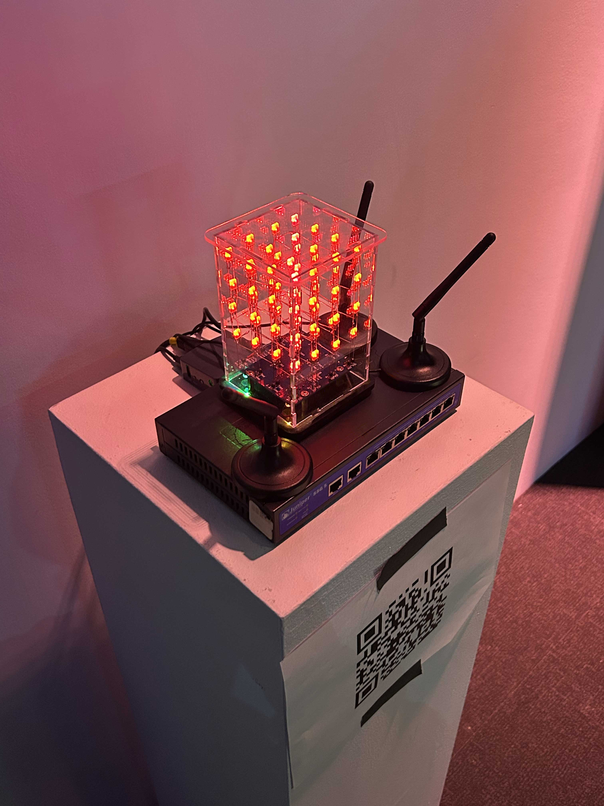
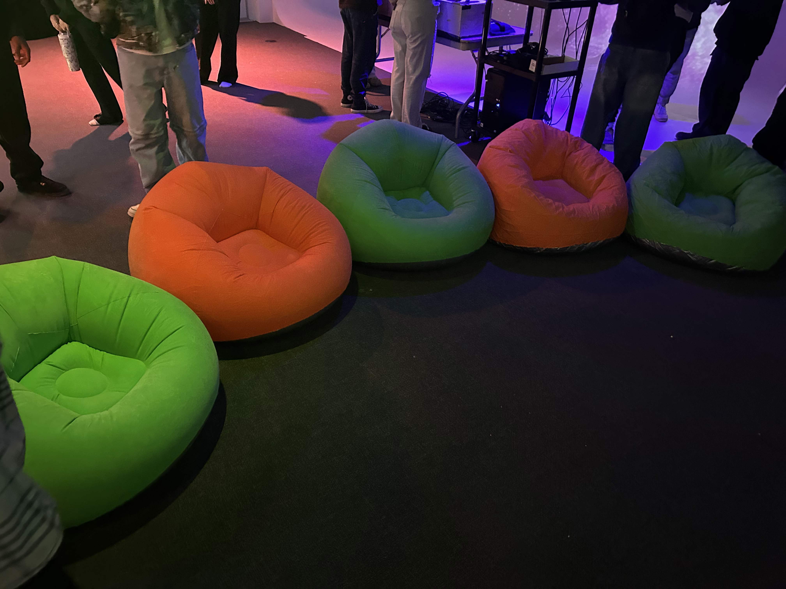
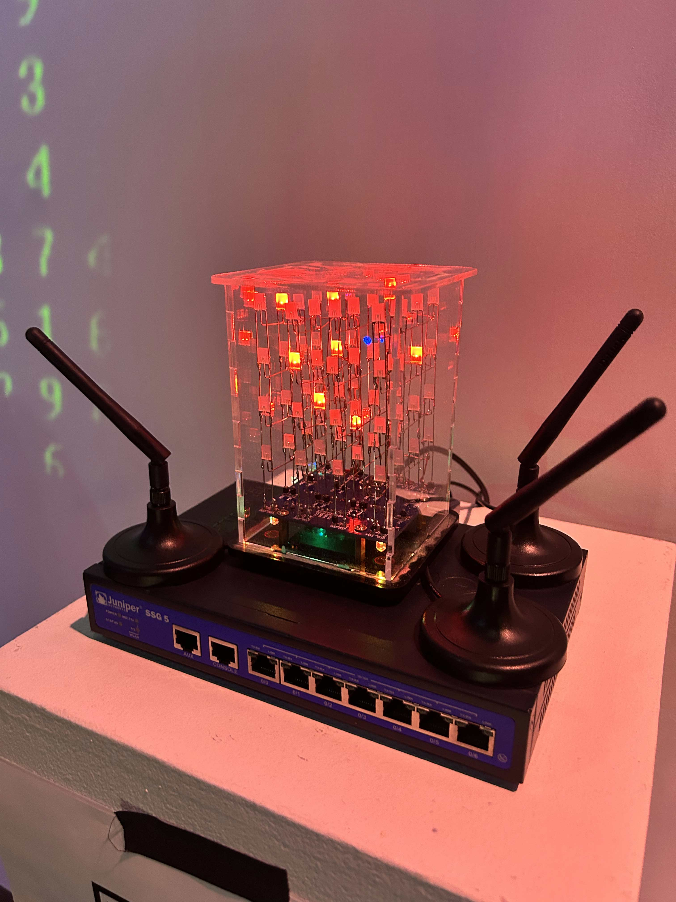
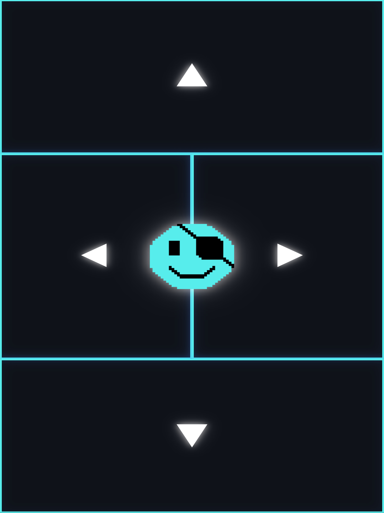
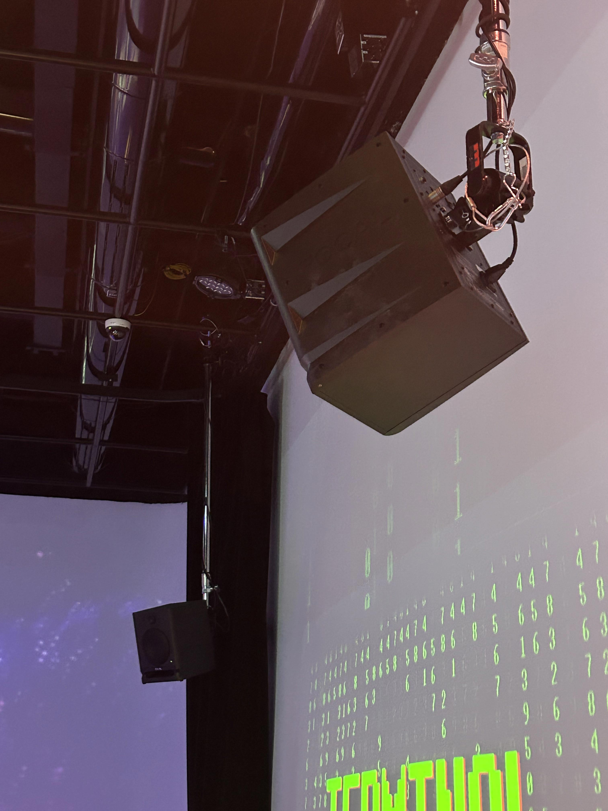
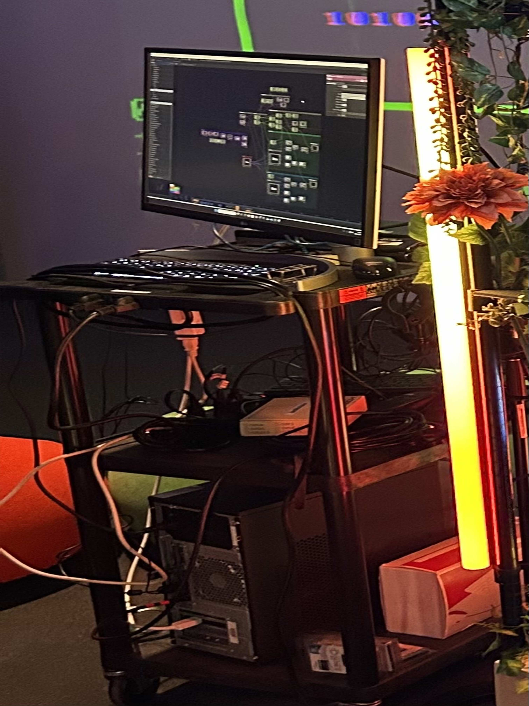

# RÉSEAU VIVANT

 

> À gauche figure une photo de l'affiche de l'exposition. À droite, une photo de moi devant le lieu où se tenait l'exposition.  

## Contexte de l'exposition
L’exposition **Réseau vivant** s’inscrit dans le cadre du cours synthèse Expérience multimédia interactive offert au **Collège Montmorency**. Elle regroupe les projets de création réalisés par les étudiant·e·s finissant·e·s du programme, mettant en pratique les compétences acquises tout au long de leur formation.

Ces projets prennent la forme d’expériences multimédias interactives conçues en équipe, allant de la conceptualisation jusqu’à la présentation finale. L’exposition met en valeur des installations, des parcours ou des performances interactives ancrées dans un environnement physique, combinant programmation, design graphique, vidéo et sonore.

- Date de visite : **17 mars 2026**
- Type d'exposition: **Intérieure et Temporaire**

## Présentation de l'oeuvre
L’œuvre étudiée, **Terminal (2026)**, est une installation interactive réalisée par une équipe de cinq étudiant·e·s finissant·e·s en technique d’intégration multimédia.

 

> Oeuvre de l'équipe Terminal, *Terminal*, 2026, présentée lors de l'exposition **RÉSEAU. 2026**, ainsi que son cartel d'informations.

L’équipe est composée de cinq étudiant·e·s finissant·e·s en technique d’intégration multimédia. Ils utilisent la programmation et le design interactif pour créer une expérience de jeu immersive et collaborative.

Terminal est un jeu collaboratif pouvant accueillir jusqu’à six joueurs. Chaque participant contrôle un opérateur à l’aide de son téléphone, qui agit comme une manette. L’objectif est de traverser différents niveaux afin de restaurer un ancien réseau informatique corrompu par une cyberattaque.
Dans le jeu, chaque déplacement laisse une trace qui devient un obstacle pour les autres joueurs. Cette mécanique oblige les participants à communiquer, se coordonner et réfléchir ensemble pour atteindre la fin des niveaux sans être éliminés. Si un joueur échoue, toute l’équipe doit recommencer, ce qui renforce l’aspect collectif de l’expérience.

- Titre de l'oeuvre: Terminal
- Nom des artistes : Émeryk Bélisle, Elie Daher, Ting Yung Lu Terry, Dana Saavedra-Torrano et Mégane Ranger
- Année de réalisation : 2026
- Type d'installation: Interactive

## Organisation de l'installation

 

> Croquis représentatif de comment est disposée l'oeuvre choisie.

Dans la salle d’exposition, les joueurs doivent d’abord scanner un code QR placé sur un podium afin de se connecter au jeu avec leur téléphone. Une fois connectés, ils prennent place sur des poufs, face à une grande projection où se déroule la partie.

   

> Photos de quelques éléments nécessaires à la conception de l'oeuvre.

Le podium, situé en diagonale sur la droite, regroupe des éléments nécessaires au démarrage de l’expérience, soit un routeur Wi-Fi et le code QR permettant l’accès au jeu.
 
  

> Sur la gauche, une photo du routeur nécessaire à la conception de l'oeure.  
> Sur la droite, une photo de l'interface sur le téléphone de l'utilisateur une fois le code QR scanné.

De chaque côté, en hauteur, des haut-parleurs diffusent le son de l’expérience. À l’arrière de l’espace, un ordinateur principal placé sur un chariot exécute le jeu, gère les connexions et contrôle la projection. Juste au-dessus, un projecteur affiche le jeu en grand format sur un mur blanc.

    

> Photos de quelques composantes nécessaires à la conception de l'oeuvre.
> Pour la quatrième photo nous avons Oeuvre de l'équipe Terminal, *Terminal*, 2026, présentée lors de l'exposition **RÉSEAU. 2026**, prise dans un angle pour accentuer les éléments nécessaires à une bonne présentation.

Composantes et techniques
- Ordinateur principal
- Téléphones
- Projecteur
- Routeur Wi-Fi
- Haut-parleurs

Éléments nécessaires à la mise en exposition
- Podium
- Mur blanc 
- Poufs 

## Expérience et appréciation de l'oeuvre

Pour accéder à l’installation Terminal, il suffit d’entrer dans la salle et de se diriger en diagonale vers la gauche. L’emplacement est facile à trouver et le parcours est simple à comprendre.

 

> Photo d'une vue d'ensemble de la salle d'exposition

Ce que j’ai particulièrement aimé est le fait que le jeu s’adapte automatiquement au nombre de joueurs. Lorsqu’une nouvelle personne rejoint la partie, le niveau change pour s’ajuster (2 joueurs, puis 3, etc., jusqu’à 6). Cela rend l’expérience dynamique et intéressante.
J’ai aussi apprécié le niveau de difficulté, qui correspond bien à ce que j’aime dans les jeux, ce qui a rendu l’expérience encore plus engageante.

Un aspect que je ferais différemment concerne le routeur Wi-Fi, qui est placé à l’air libre. Cela peut représenter un risque, car il pourrait être déplacé ou débranché facilement, ce qui interromprait le jeu. Une installation plus sécurisée serait préférable.

## Références
- Photographe pour toute la documentation : Berbiche, Wilhene

Liens consultés:
- (https://pythons-5.github.io/Terminal/#/)
