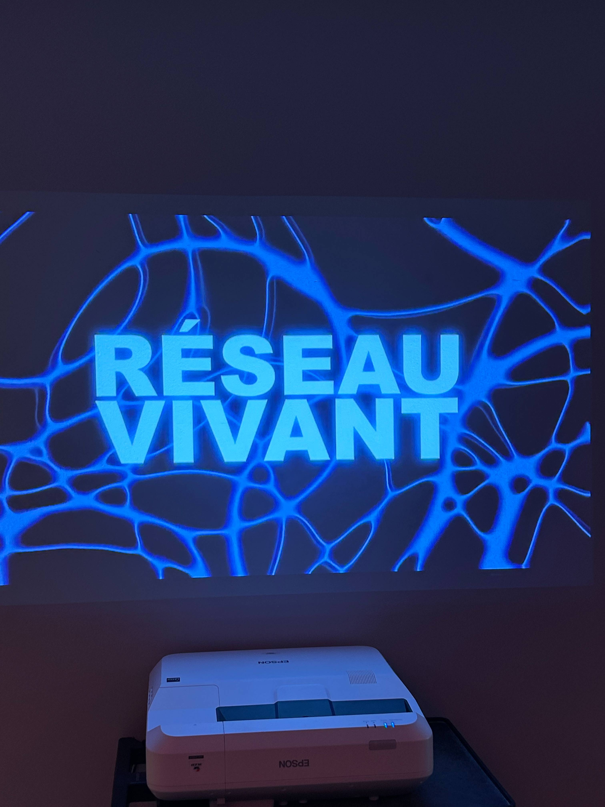
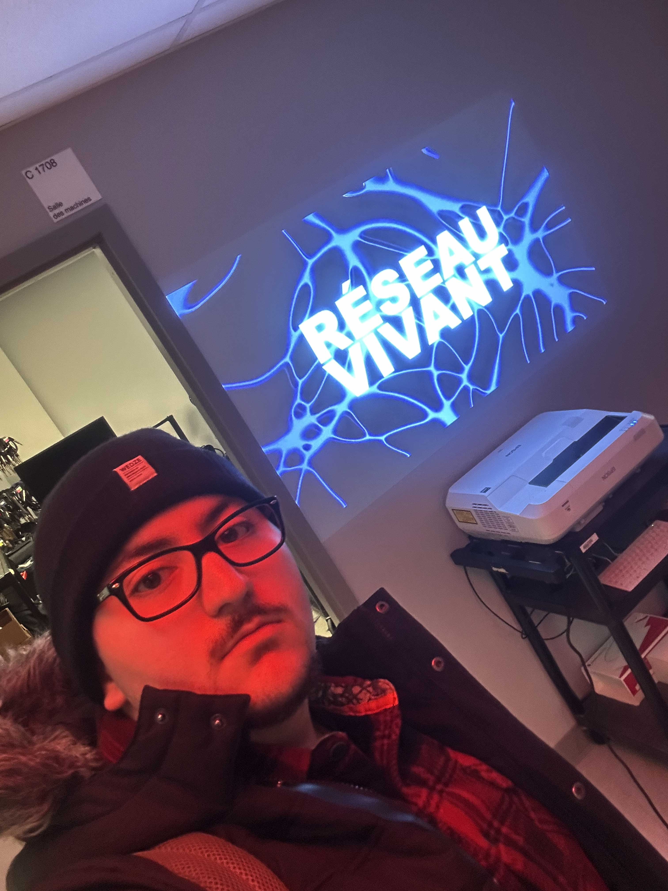
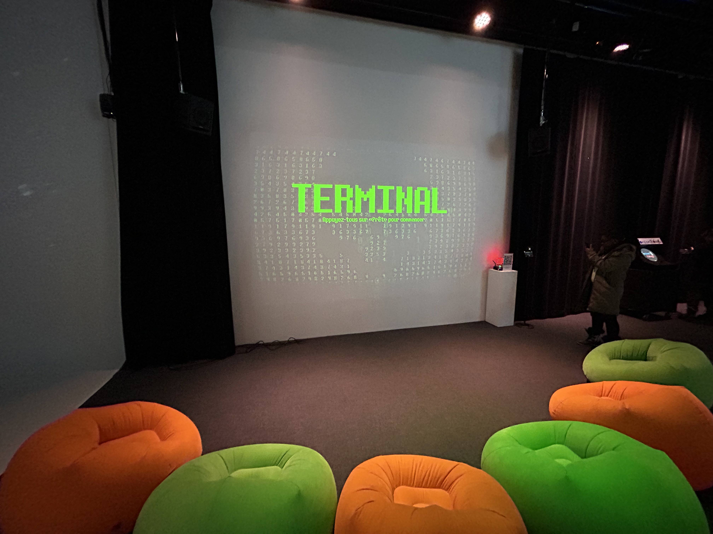
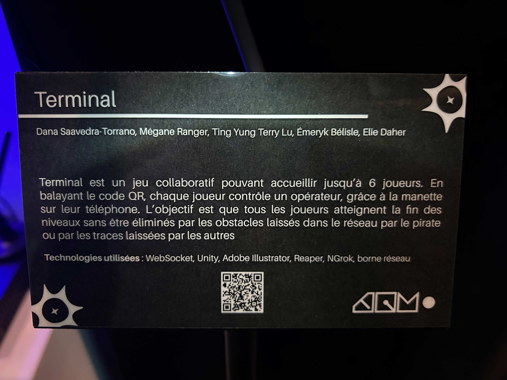
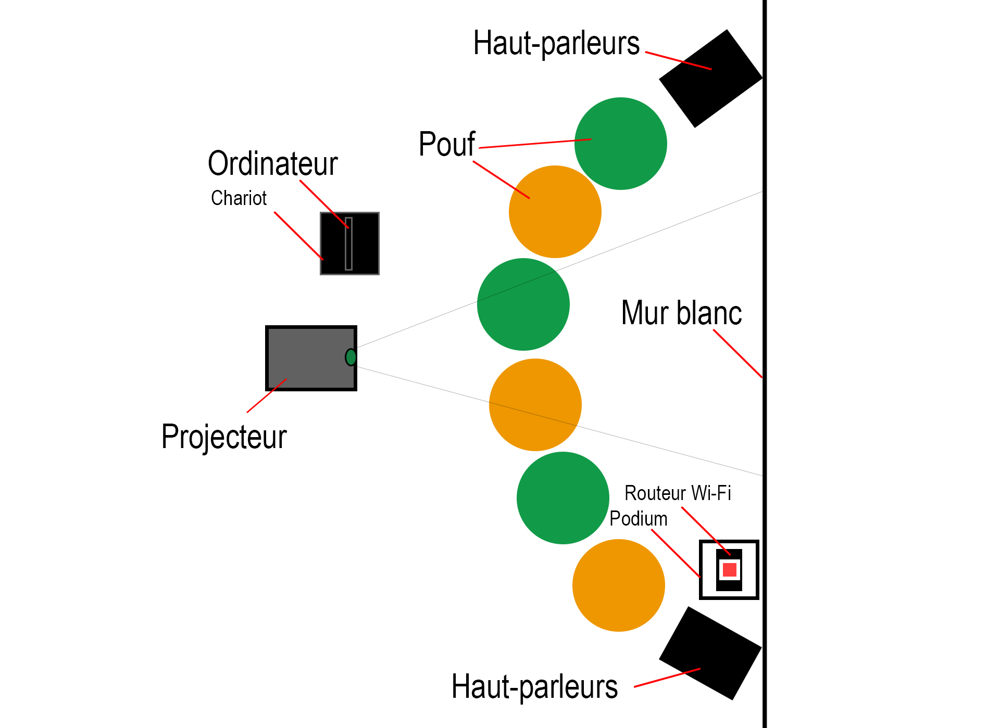
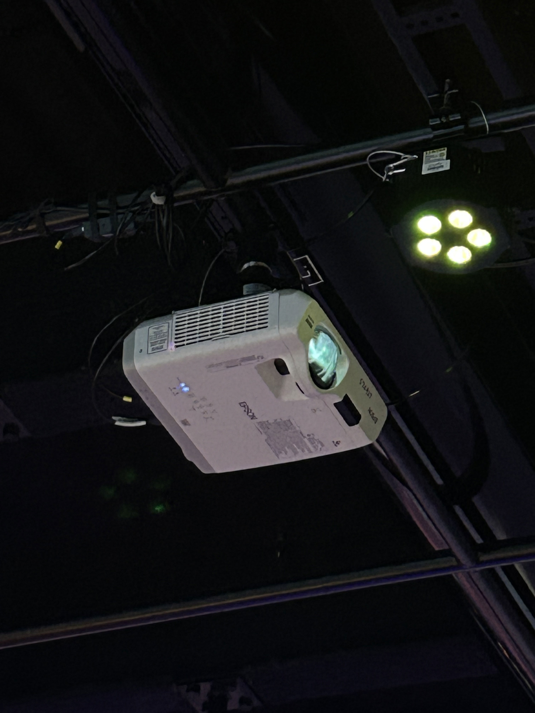
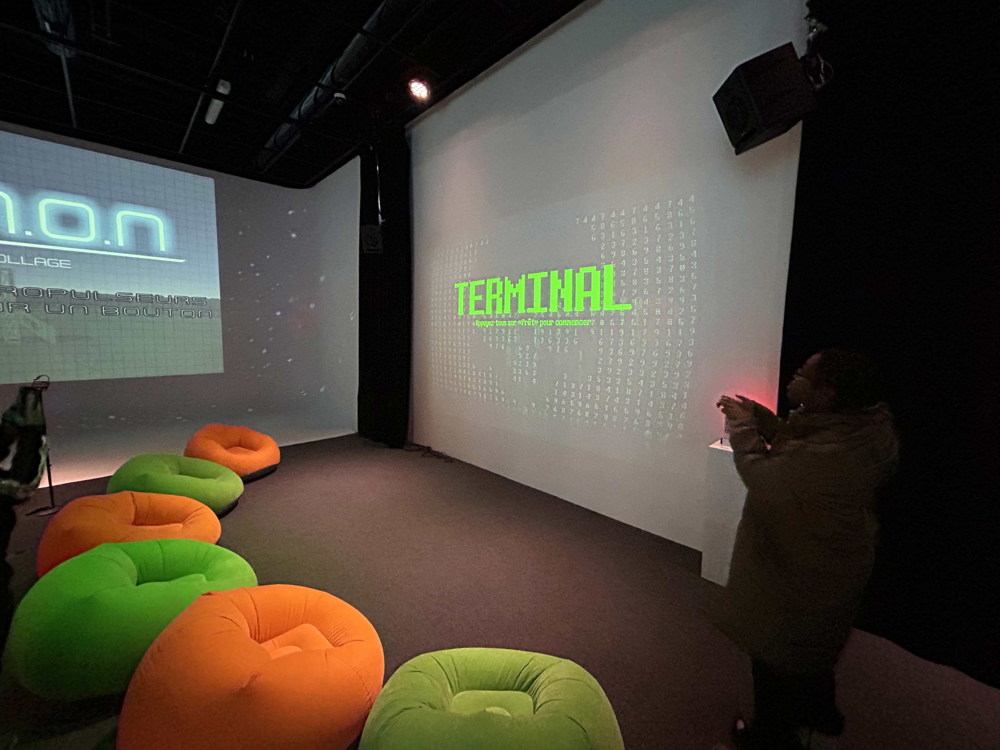
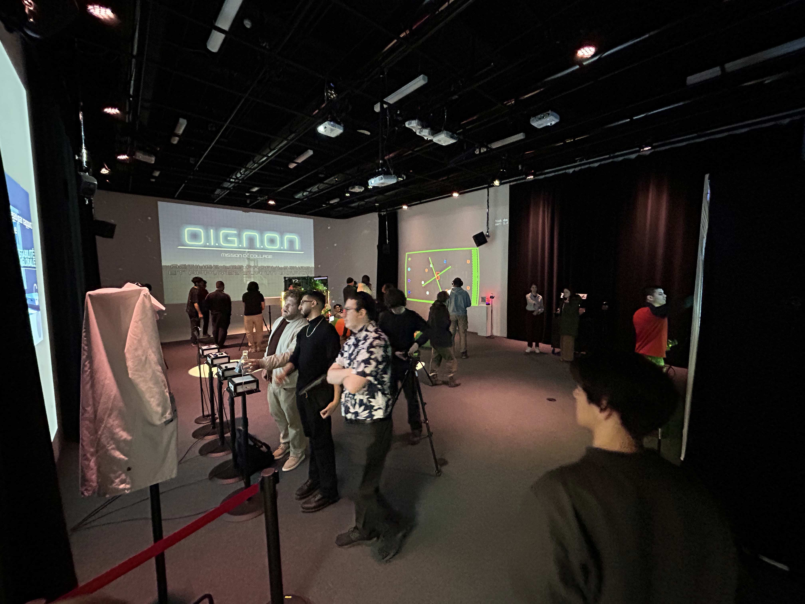

# RÉSEAU VIVANT

 

> À gauche figure une photo de l'affiche de l'exposition. À droite, une photo de moi devant le lieu où se tenait l'exposition.  

## Contexte de l'exposition
L’exposition **Réseau vivant** s’inscrit dans le cadre du cours synthèse Expérience multimédia interactive offert au **Collège Montmorency**. Elle regroupe les projets de création réalisés par les étudiant·e·s finissant·e·s du programme, mettant en pratique les compétences acquises tout au long de leur formation.

Ces projets prennent la forme d’expériences multimédias interactives conçues en équipe, allant de la conceptualisation jusqu’à la présentation finale. L’exposition met en valeur des installations, des parcours ou des performances interactives ancrées dans un environnement physique, combinant programmation, design graphique, vidéo et sonore.

- Date de visite : **17 mars 2026**
- Type d'exposition: **Intérieure et Temporaire**

## Présentation de l'oeuvre
L’œuvre étudiée, **Terminal (2026)**, est une installation interactive réalisée par une équipe de cinq étudiant·e·s finissant·e·s en technique d’intégration multimédia.

 

> Oeuvre de l'équipe Terminal, *Terminal*, 2026, présentée lors de l'exposition **RÉSEAU. 2026**, ainsi que son cartel d'informations.

L’équipe est composée de cinq étudiant·e·s finissant·e·s en technique d’intégration multimédia. Ils utilisent la programmation et le design interactif pour créer une expérience de jeu immersive et collaborative.

Terminal est un jeu collaboratif pouvant accueillir jusqu’à six joueurs. Chaque participant contrôle un opérateur à l’aide de son téléphone, qui agit comme une manette. L’objectif est de traverser différents niveaux afin de restaurer un ancien réseau informatique corrompu par une cyberattaque.
Dans le jeu, chaque déplacement laisse une trace qui devient un obstacle pour les autres joueurs. Cette mécanique oblige les participants à communiquer, se coordonner et réfléchir ensemble pour atteindre la fin des niveaux sans être éliminés. Si un joueur échoue, toute l’équipe doit recommencer, ce qui renforce l’aspect collectif de l’expérience.

- Titre de l'oeuvre: Terminal
- Nom des artistes : Émeryk Bélisle, Elie Daher, Ting Yung Lu Terry, Dana Saavedra-Torrano et Mégane Ranger
- Année de réalisation : 2026
- Type d'installation: Interactive

## Organisation de l'installation

 

> Croquis représentatif de comment est disposée l'oeuvre choisie.

Dans la salle d’exposition, les joueurs doivent d’abord scanner un code QR avec leur téléphone afin de se connecter au jeu. Ils prennent ensuite place sur des poufs, face à une grande projection où se déroule la partie.

 

> Photo de l'une des composantes nécessaires à la conception de l'oeuvre.

En diagonale par rapport aux poufs, se trouve un podium sur lequel sont installés le routeur Wi-Fi ainsi que le code QR permettant d’accéder au jeu scannés plutot avant de s'assoiere.

   

> Photos d'autres composantes nécessaires à la conception de l'oeuvre.

Pour que l’œuvre puisse être présentée correctement, certains éléments simples mais essentiels sont nécessaires, notamment un mur blanc servant de surface de projection et un banc permettant au visiteur de s’asseoir et de vivre l’expérience dans une position stable. L’ensemble crée un dispositif à la fois technique et minimal, où chaque élément a une fonction précise.

 

> Photo de l’œuvre de Marion Schneider, *Terre commune*, 2025, présentée lors de l’exposition **DEVENIRS PARTAGÉS. PRATIQUES DE L’IA. 2026**, prise dans un angle pour accentuer les éléments nécessaires à une bonne présentation.

Composantes:
- Ordinateur
- Écran
- Projecteur
- Capteur
- Câbles électrique

Éléments nécessaires à la mise en exposition:
- Mur blanc
- Banc

## Expérience et appréciation de l'oeuvre

Le parcours pour accéder à l’installation est très simple. En entrant dans la salle, il suffit de marcher tout droit pour arriver à Terre commune. Il n’y a pas de mise en scène compliquée, ce qui permet de découvrir l’œuvre naturellement.

 

> Photo d'une vue d'ensemble de la salle d'exposition

Ce qui m’a particulièrement plu est l’aspect interactif lié au capteur. Le fait d’essayer de stabiliser mon cerveau pour calmer les ondes et les lignes affichées à l’écran rend l’expérience très personnelle. On prend conscience de son propre état mental et on tente de le contrôler, ce qui crée un moment de concentration inhabituel et engage réellement le participant dans l’œuvre.

Cependant, un aspect que je ne retiendrais pas dans une création personnelle concerne l’installation de l’ordinateur sous le banc. Il n’est pas protégé, ce qui présente un risque : si le banc se brisait ou si quelqu’un s’asseyait brusquement, l’ordinateur pourrait être endommagé et cela pourrait même causer une blessure. Pour améliorer ce point, je placerais l’ordinateur à côté, dans un boîtier ou une structure de protection, afin d’assurer la sécurité du matériel et des visiteurs.

## Références
- Photographe pour toute la documentation : Berbiche, Wilhene  
- Photographe pour la photo de moi devant le lieu de l'exposition: Nguyen, Phu Thanh.  

Liens consultés:
- (https://schneidermarion.net/)
- (https://nouvelles.umontreal.ca/article/2025/12/04/quatre-artistes-repensent-l-intelligence-artificielle)
# Référence
- (https://pythons-5.github.io/Terminal/#/)
