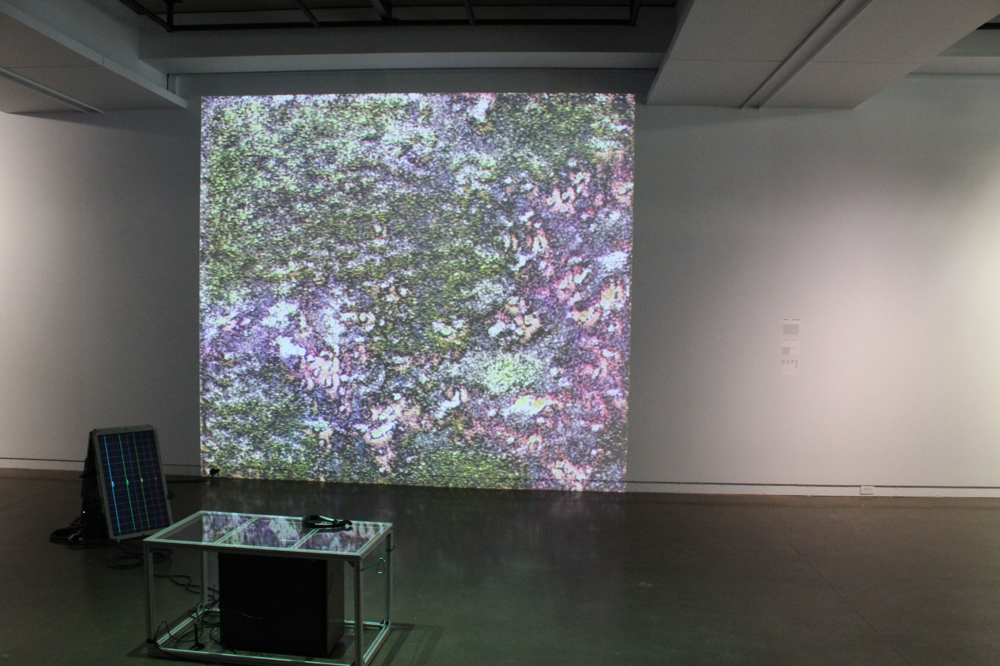
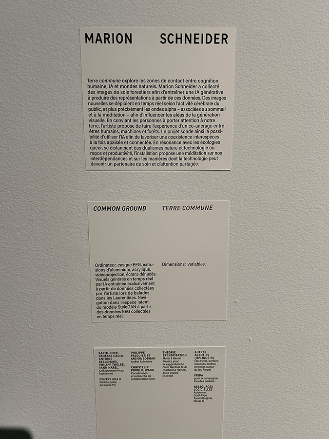

# DEVENIRS PARTAGES. PRATIQUES DE L'IA.

 

## Contexte de l'exposition
**L’exposition Devenirs partagés : pratiques de l’IA** s’inscrit dans un contexte de recherche-création explorant des usages critiques et sensibles de l’intelligence artificielle. Présentée à **l’Université de Montréal**, elle réunit plusieurs artistes invités à expérimenter des approches alternatives aux imaginaires dominants de l’IA, souvent associés à la performance, à l’automatisation ou à l’efficacité.

L’exposition propose plutôt de considérer l’intelligence artificielle comme un médium relationnel, permettant de réfléchir aux liens entre humains, technologies et environnements.

- Date de visite : **30 janvier 2026**
- Type d'exposition: **Intérieure et Temporaire**

# Présentation de l'oeuvre
L’œuvre étudiée, Terre commune (2025) de Marion Schneider, est une installation interactive qui explore les relations entre états physiologiques humains, milieux naturels et systèmes computationnels.

 

Marion Schneider est une artiste numérique basée à Montréal dont la pratique interdisciplinaire mobilise l’installation, la programmation et les technologies interactives afin d’aborder des enjeux liés à l’écologie, à la perception et aux relations entre corps et machines.

Dans Terre commune, l’activité cérébrale du visiteur est captée à l’aide d’un casque. Ces données influencent en temps réel un paysage généré par intelligence artificielle, composé d’images inspirées d’éléments organiques comme des mousses, des lichens et des textures du sol.
L’image produite évolue continuellement selon l’état du participant, créant une interaction où l’humain et le système technique co-produisent l’environnement visuel.

- Titre : Terre commune
- Artiste : Marion Schneider
- Année : 2025
- Type : Installation interactive

# Références
- (https://schneidermarion.net/)
- (https://nouvelles.umontreal.ca/article/2025/12/04/quatre-artistes-repensent-l-intelligence-artificielle)
