# MISSION VIRTUELLE : LA PLANÈTE ROUGE

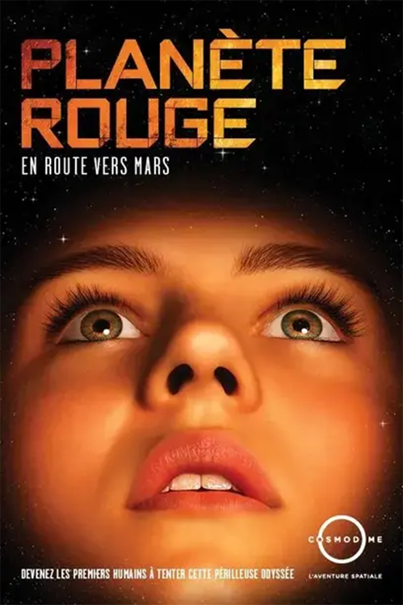 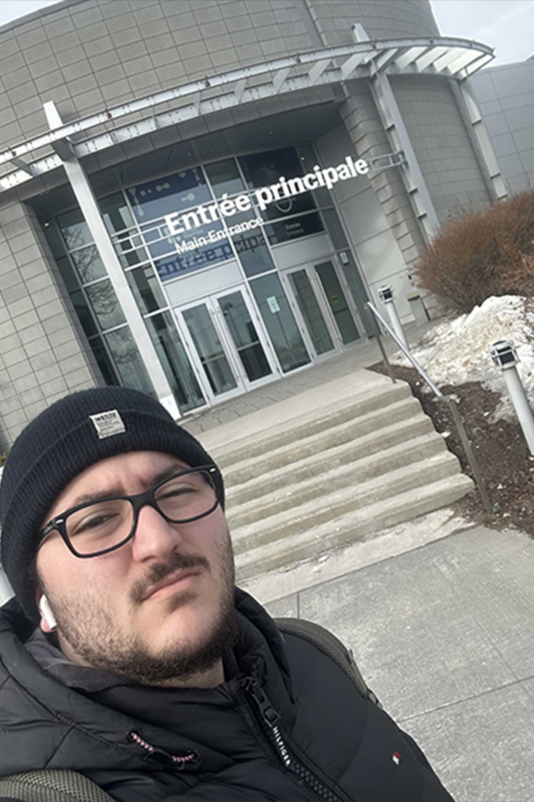

> À gauche figure une capture d'écran de l'affiche de l'expérience immersive du site web https://cosmodome.org/activites-familiale/missions-virtuelles/, consulté le 12 mars 2026.   À droite, une photo de moi devant le lieu où se tenait l'expérience immersive.  

## Contexte de l'expérience immersive
L’exposition immersive ***La planète rouge***, présentée au **Cosmodôme** de Laval, s’inscrit dans un contexte de découverte scientifique et d’éducation autour de l’exploration spatiale. Cette expérience propose aux visiteurs de se plonger dans une mission simulée vers la planète Mars, en les plaçant dans le rôle d’un équipage d’astronautes devant relever différents défis liés au voyage spatial.

À travers une série d’environnements immersifs et interactifs, l’exposition cherche à faire découvrir les réalités scientifiques et technologiques associées aux missions spatiales.

- Date de visite: **3 mars 2026**
- Type d'exposition: **Intérieure et Permanente**

## Présentation du dispositif
Le dispositif étudié, ***La planète rouge*** **(2011)**, conçu par la firme **GSM Project**, est une installation **immersive** et **interactive** qui propose aux visiteurs de participer à une mission simulée vers la planète Mars.

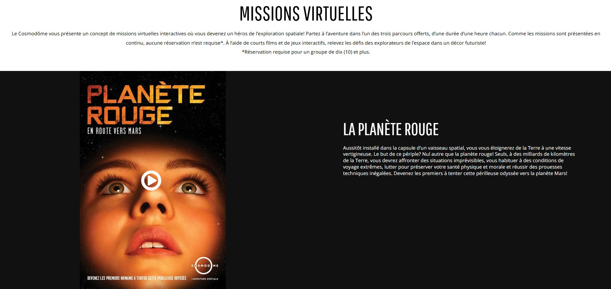

> Capture d'écran du site web https://cosmodome.org/activites-familiale/missions-virtuelles/, consulté le 21 janvier 2024.

**GSM Project** est une firme montréalaise spécialisée dans la conception d’expositions muséales et d’expériences immersives. L’entreprise développe des installations qui combinent scénographie, technologies multimédias et interaction afin de rendre les contenus scientifiques et culturels plus accessibles au public.

Dans ***La planète rouge***, les visiteurs prennent part à une mission spatiale où ils doivent collaborer pour accomplir différentes tâches liées au voyage vers Mars. L’expérience se déroule dans un environnement scénographié qui reproduit l’intérieur d’un vaisseau spatial et différents espaces de mission. Les participants interagissent avec plusieurs dispositifs technologiques, qui permettent de suivre la progression de la mission et de déclencher certaines actions dans l’installation.

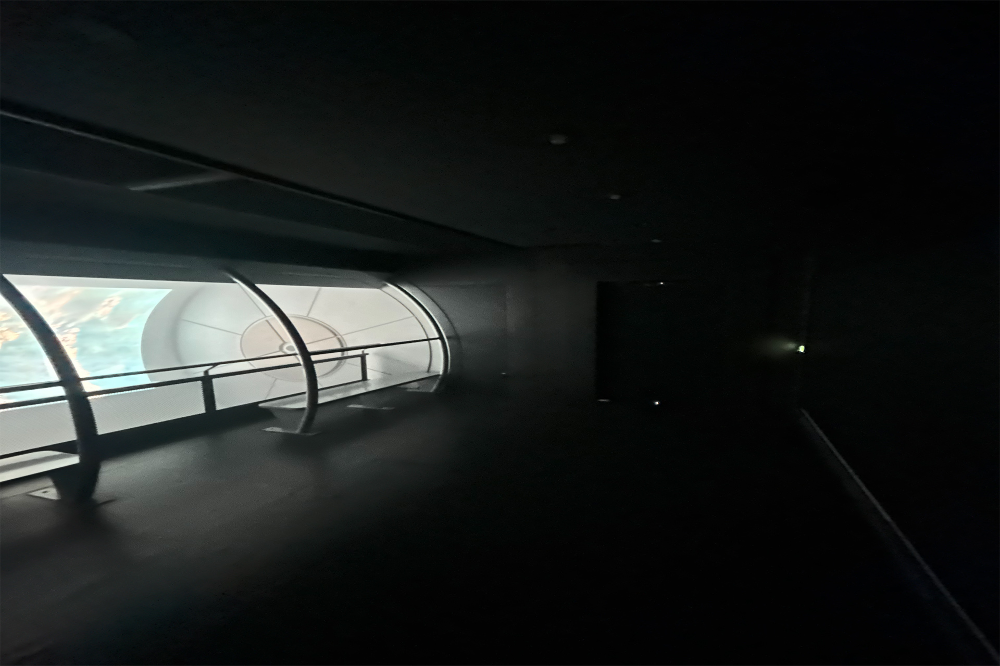 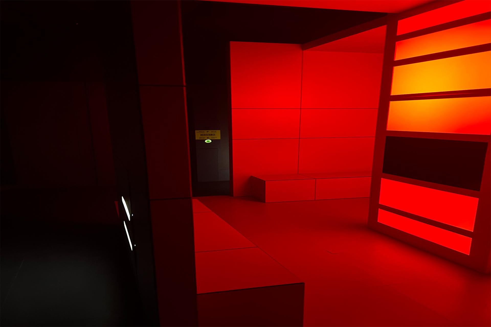 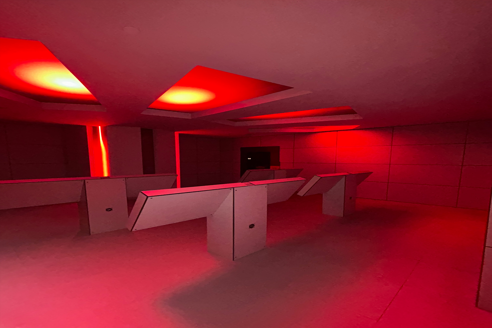 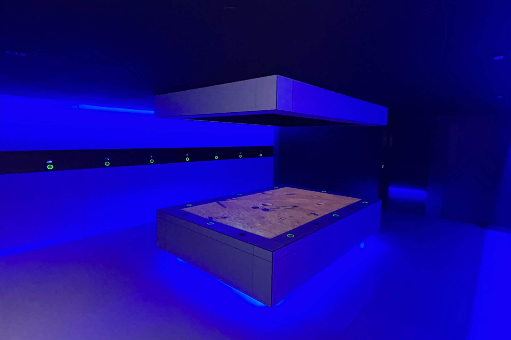

> Photos de vues d'ensemble de quelques pièces de l'expérience immersive

- Titre du dispositif : ***La planète rouge***
- Nom de la firme : **GSM Project**
- Année de réalisation : **2011**
- Type d'installation: **Interactive & immersive**

## Organisation de l'installation
La **fonction** du dispositif est de plonger les visiteurs dans une simulation immersive de mission spatiale vers la planète Mars. Avant le début de l’expérience, les visiteurs reçoivent également un bracelet interactif RFID, qui leur permet d’activer les différentes stations et de participer aux activités interactives tout au long du parcours. Dès le début de l’expérience, les participants prennent place dans la capsule d’un vaisseau spatial et quittent symboliquement la Terre pour entreprendre un voyage vers la planète rouge. Au cours de cette mission, les visiteurs doivent faire face à différentes situations imprévisibles liées au voyage spatial. Ils doivent s’adapter à des conditions de déplacement extrêmes, collaborer pour résoudre des problèmes techniques et veiller au maintien de la santé physique et mentale de l’équipage. L’installation met ainsi les participants dans la peau d’astronautes devant accomplir une mission complexe à plusieurs milliards de kilomètres de la Terre. 

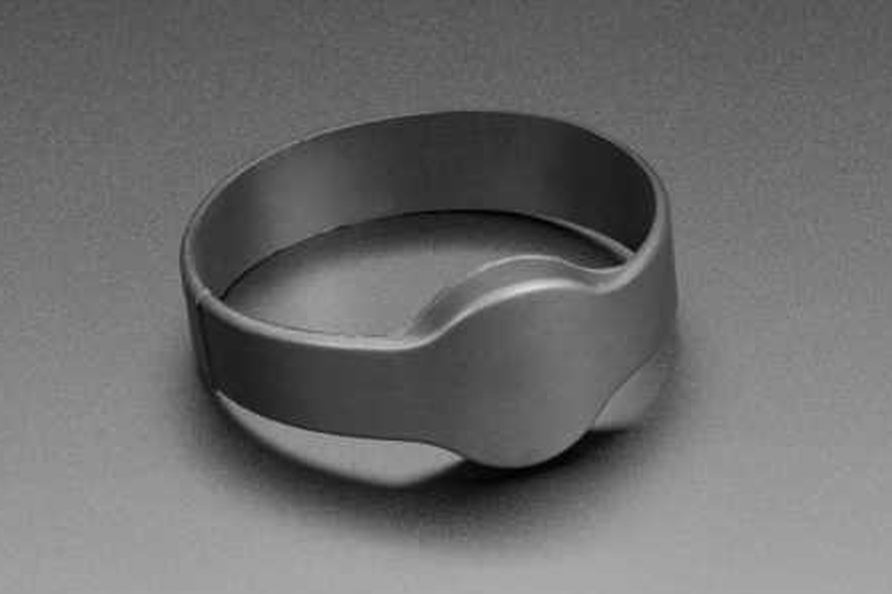 

> Capture d'écran de l'article « Bracelet RFID » du site web https://boutique.semageek.com/fr/1500-bracelet-rfidnfc-1356mhz-puce-ntag203-3002365582174.html, consulté le 12 mars 2026.

L’installation ***La planète rouge*** est organisée sous forme d’un parcours séquentiel composé de plusieurs salles thématiques reliées entre elles par des couloirs scénographiés rappelant l’intérieur d’un vaisseau spatial. Chaque salle présente une étape différente de la mission vers Mars et combine capsules audiovisuelles et activités interactives.

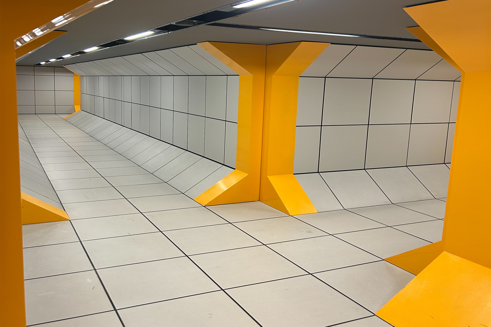 

> Photo de l’un des couloirs scénographiés reliant les différentes salles de l’expérience immersive.

### Salle A2 - Première salle

La première salle sert d’introduction à l’expérience. En entrant dans la pièce, les visiteurs aperçoivent la porte menant à la salle suivante située droit devant eux. Sur la gauche, deux bancs permettent aux participants de s’asseoir face à un mur où est projetée une capsule vidéo immersive. Devant les bancs se trouve une barrière de sécurité séparant les visiteurs d’un espace légèrement en contrebas. 

Dans cet espace sont dissimulés les équipements techniques, notamment un projecteur et des haut-parleurs, qui permettent de diffuser la projection audiovisuelle. Cette capsule sert à introduire la mission et à placer les visiteurs dans le contexte du voyage vers Mars. À la fin de la projection, la porte s’ouvre menant à la salle suivante vers la salle suivante : A3.

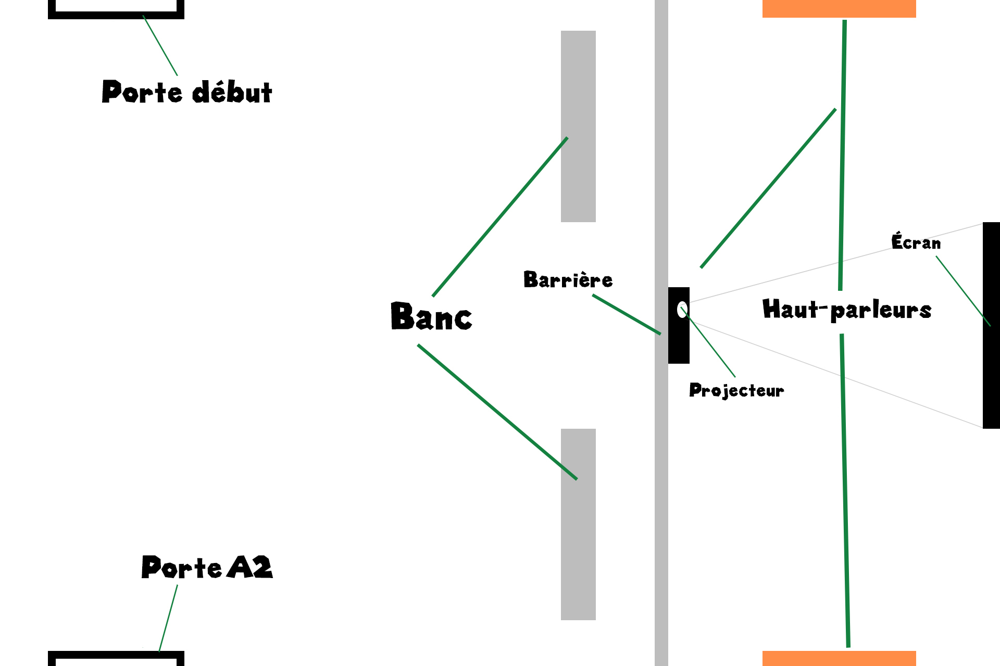

> Croquis représentatif de la salle A2 de l'expérience immersive

### Salle A3 - Deuxième salle

La seconde salle est de forme carrée. Au centre de l’espace se trouve un pilier lumineux rouge de forme carrée, comportant quatre écrans intégrés, un sur chaque face. Devant chaque écran se trouvent des bancs fixés aux murs, permettant aux visiteurs de s’asseoir pour visionner les capsules vidéo diffusées. Derrière ces murs-bancs se trouvent des espaces de circulation permettant aux visiteurs de se déplacer autour de la structure centrale.

Le plafond est équipé de haut-parleurs qui diffusent le contenu audio des capsules. Cette salle sert principalement à présenter des informations supplémentaires sur la mission et le voyage vers Mars. Une porte située en diagonale de l’entrée mène ensuite vers la salle suivante: A4.

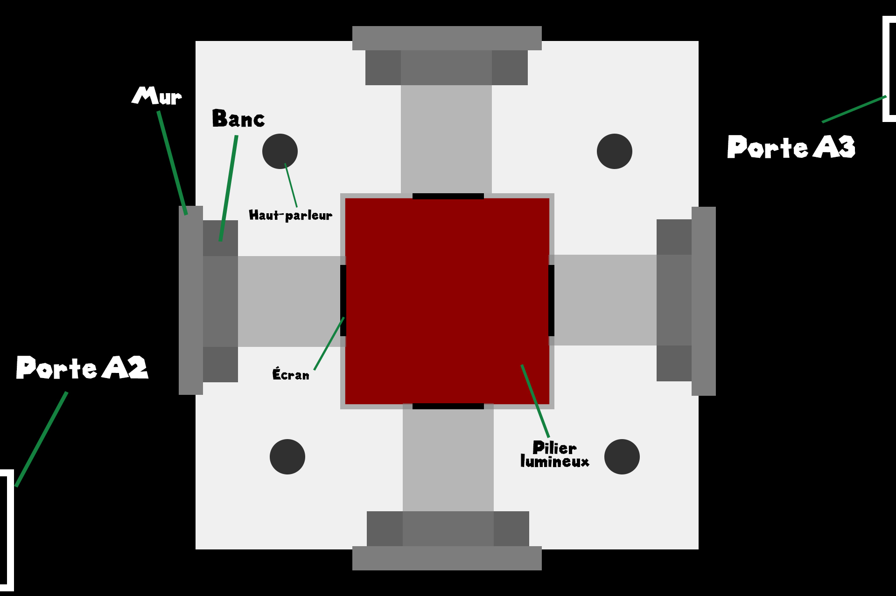

> Croquis représentatif de la salle A3 de l'expérience immersive

### Salle A4 – Troisième salle

La troisième salle est rectangulaire et introduit la première activité interactive. En entrant, les visiteurs aperçoivent un pilier lumineux décoratif composé de plusieurs bandes lumineuses verticales. Sur le côté droit de la pièce se trouvent quatre stations interactives, disposées de manière similaire à des bureaux face à un écran principal.

Chaque station comprend deux écrans tactiles, permettant à deux participants de jouer simultanément. Les stations comportent également des zones circulaires de scan permettant d’activer les dispositifs grâce au bracelet interactif. Dans cette activité, les participants doivent programmer les déplacements d’un véhicule d’exploration spatiale en planifiant une série de mouvements directionnels. Une fois les commandes programmées, le véhicule suit les instructions données afin d’atteindre une destination précise sur la carte. Une porte située au fond en face de la porte de l’entrée qui mène ensuite vers la salle suivante: B1.

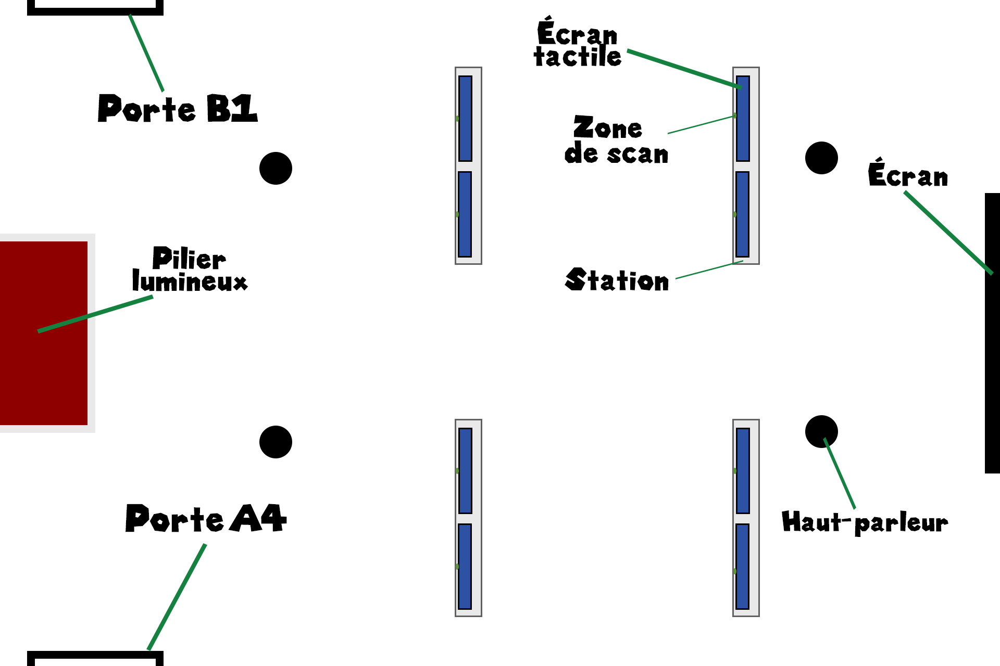

> Croquis représentatif de la salle A4 de l'expérience immersive

### Salle B1 – Quatrième salle

La salle suivante est rectangulaire et propose une seconde activité interactive. Sur les murs se trouvent huit stations de jeu, chacune équipée d’un écran tactile et d’une zone de scan permettant d’activer le dispositif.

Certains murs sont recouverts de grands miroirs, ce qui agrandit visuellement l’espace et renforce l’effet immersif de l’installation. Un écran mural diffuse également une capsule vidéo liée à la mission. Les participants doivent réaliser plusieurs tests simulant les compétences nécessaires pour piloter un vaisseau spatial. Parmi ces tests se trouvent un exercice de mémoire, un exercice de repérage visuel sur une carte de Mars, ainsi qu’un test final de pilotage consistant à guider un vaisseau à travers des anneaux. Une porte située au fond à droite de la porte de l’entrée qui mène ensuite vers la salle suivante: C1.

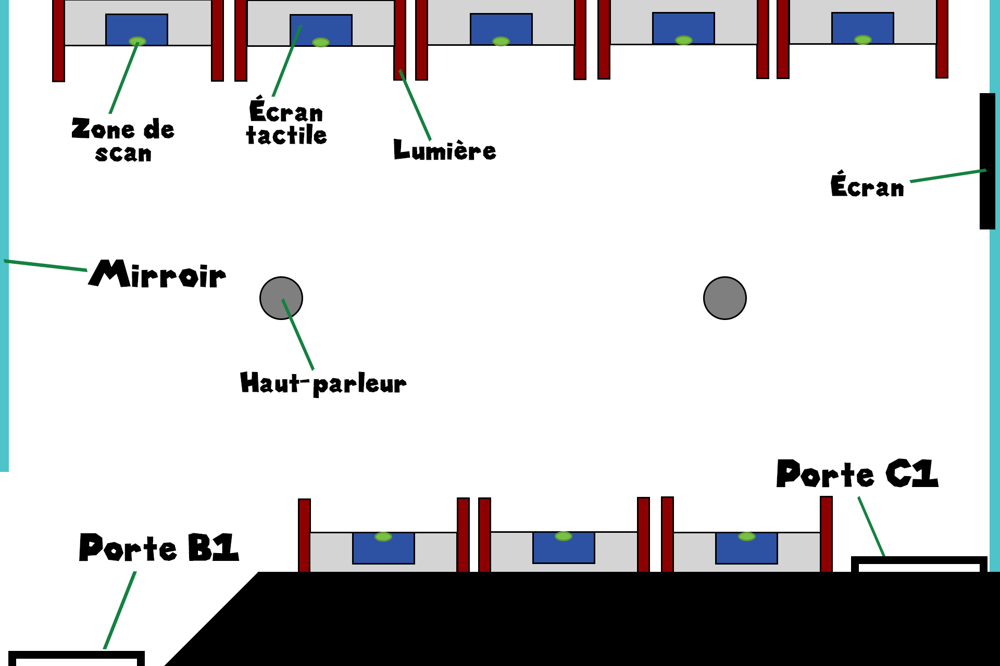

> Croquis représentatif de la salle B1 de l'expérience immersive

### Salle C1 – Cinquième salle

La salle suivante présente la troisième et dernière activité interactive. Au centre de la pièce se trouve une grande table interactive intégrant un écran horizontal sur lequel est projetée une carte de la planète Mars. Autour de cette table se trouvent huit zones de scan permettant aux participants d’activer leur station de jeu. Sur les murs de la salle se trouvent également seize petits écrans, chacun associé à une zone de scan.

Dans cette activité, les participants doivent identifier différentes images apparaissant sur la carte de Mars et retrouver ces images sur les écrans situés sur les murs. Lorsqu’une image correcte est trouvée, elle est validée et ajoutée à la carte projetée sur la table. Une porte située au fond en face de la porte de l’entrée qui mène ensuite vers la dernière salle.

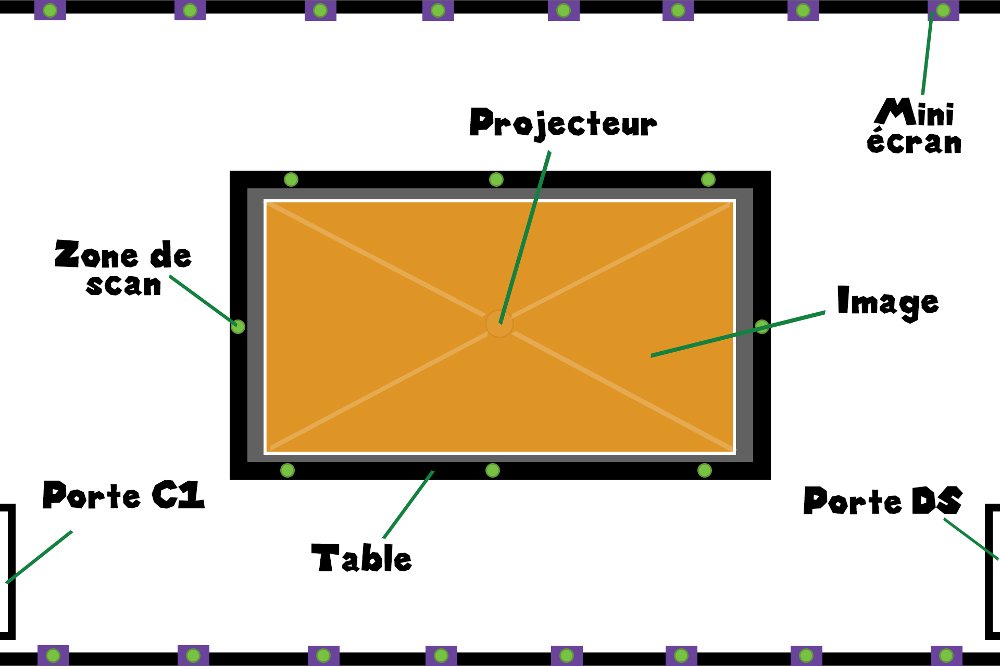

> Croquis représentatif de la salle C1 de l'expérience immersive

### Salle finale – Dernière salle

La dernière salle sert de conclusion à l’expérience. Il s’agit d’un espace rectangulaire allongé comprenant des bancs disposés le long du mur gauche, permettant aux visiteurs de s’asseoir. Sur le mur opposé se trouvent trois grands écrans accompagnés de dispositifs d’éclairage. Une dernière capsule vidéo y est diffusée afin de conclure la mission et de résumer l’expérience vécue. La sortie de l’exposition se trouve à l’extrémité de cette salle.

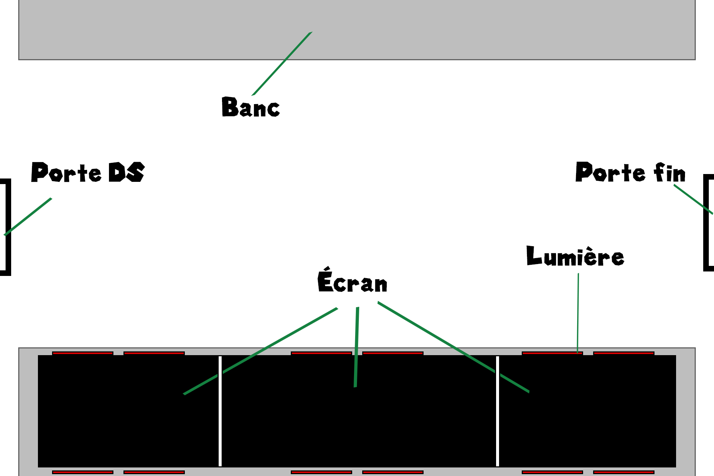

> Croquis représentatif de la dernière salle de l'expérience immersive

Composantes:

- Écrans 
- Écrans tactiles
- Mini écrans
- Stations interactive
- Projecteurs
- Haut-parleurs
- Bracelet RFID
- Lecteur RFID
- Zones circulaires de scan (capteurs)
- Système d’éclairage intégré (piliers lumineux, lumières d’ambiance)

Éléments nécessaires à la mise en exposition:

- Bancs
- Murs
- Portes
- Couloirs (style vaisseau spatial)
- Piliers
- Barrières
- Système de ventilation

## Expérience et appréciation de l’œuvre

Ce que j’ai particulièrement apprécié dans cette installation est la présence de plusieurs activités interactives réparties dans différentes salles. Les jeux proposés sont variés et demandent la participation des visiteurs, ce qui rend l’expérience dynamique et intéressante. L’utilisation du bracelet interactif contribue également à renforcer l’immersion, car il permet d’activer les dispositifs et donne l’impression de faire réellement partie de l’équipage du vaisseau.

Un aspect que je pourrais améliorer dans une création similaire concerne la fluidité entre certaines étapes du parcours. Dans certains moments, l’attente entre les capsules vidéo et les activités peut ralentir légèrement le rythme de l’expérience. Dans un projet personnel, il pourrait être intéressant de rendre les transitions plus interactives ou de proposer de petites interactions supplémentaires afin de maintenir l’engagement du visiteur tout au long du parcours.

## Références
- Photographe pour toute la documentation : Berbiche, Wilhene

Liens consultés:
- (https://cosmodome.org/activites-familiale/missions-virtuelles/)
- (https://www.quebeclemag.com/cosmodome-de-laval/#:~:text=L'espace%E2%80%A6,sens%20et%20%C3%A0%20l'%C3%A9motion.)
- (https://gsmproject.com/fr/projets/etude-de-cas/le-cosmodome/#:~:text=Le%20Cosm%C3%B4dome%20de%20Laval%2C%20fond%C3%A9,'espace%20et%20l'astronautique.)
- (https://boutique.semageek.com/fr/1500-bracelet-rfidnfc-1356mhz-puce-ntag203-3002365582174.html)
